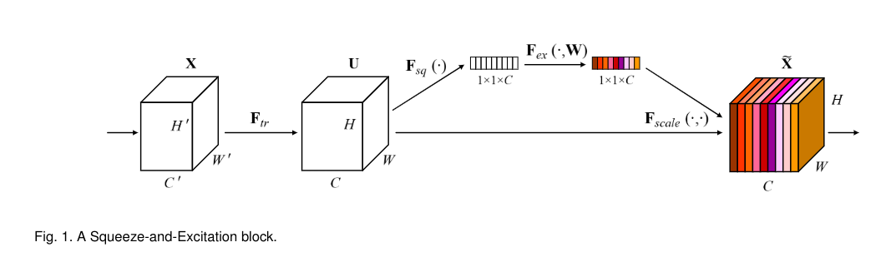
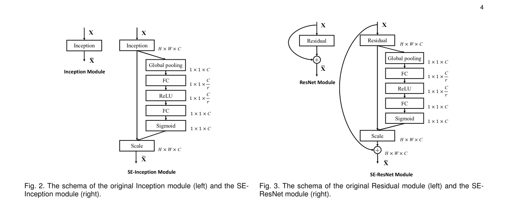

# Squeeze-and-Excitation Networks

> recalibrate：重新校准
>
> interleave：交织，(将片状物)插入、夹进
>
> salient：突出的，重要的，显著的
>
> incorporate：合并，包括
>
> aggregate: 汇总
>
> agnostic：与...无关的
>
> forgo: 放弃
>
> entangle：缠住，使陷入
>
> mitigate:  减轻，缓和
>
> opt：选择
>
> concretely：具体地
>
> from scratch：从头开始
>
> tailor：裁剪
>
> rigorous：严格的，谨慎的
>
> shed：去除，摆脱，丢掉

## 0. Abstract

CNN的核心构建模块是卷积操作，这使得网络能够通过融合每一层感受野的空间和逐通道的信息来构建信息特征。

很多之前的研究调查了这些关系的空间部分，试图通过提高特征层次中的空间编码的质量来提高CNN的表示能力。

本篇论文中，我们**关注的是通道的关系**，提出了**Squeeze-and-Excitation Block**，通过**显示建模通道之间的相互依赖性**，**自适应地重新校准逐通道的特征反馈**。

>  In this work, we focus instead on the channel relationship and propose a novel architectural unit, which we term the “Squeeze-and-Excitation” (SE) block, that adaptively recalibrates channel-wise feature responses by explicitly modelling interdependencies between channels. 

## 1. Introduction

之前的Inception结构 (包含多尺寸处理)，显示了有CNN产生的表示可以通过集成学习机制来获取特征的空间关系。

这篇论文研究了通道之间的关系，引入Squeeze-and-Excitation块，为了通过**显示建立卷积特征的通道相互依赖关系模型提高网络的表示质量**。

> improving the quality of representations produced by a network by explicitly modelling the interdependencies between the channels of its convolutional  features. 

+ 首先输入$X\in R^{H^{'} \times W^{'}\times C^{'}}$经过$F_{tr}$变成$U\in R^{H\times W\times C}$，之后将U首先传给一个**squeeze操作，通过汇总$H\times W$空间维度上的特征图产生一个通道描述符**。

+ **该描述符的功能是产生逐通道特征反馈的全局分布的向量**，使得从网络获得的全局感受野的信息可以用于所有网络层。

+ 汇总之后是**excitation操作，采取一个简单的门控机制的形式，将embedding作为输入，产生逐通道模块权重的集合。**

+ 这些权重用于特征图U来产生SE block的输出，这个输出可以直接给后面的网络层。

通过堆叠SE block就可以构建SENet了。**尽管建立block的模板是泛化的，不同深度的block扮演的角色是不一样的**。早期以和类别无关的方式激励信息特征，增强共享的低层次表示，在后面的网络层，SE block变得越来越特殊化了，以高度类别特定的方式处理不同的输入。结果就是，**SE block的特征重新校准的好处可以通过网络累积**。

## 2. Related Work

### (1) Deeper architectures

VGGNets, Inception family, BN,  ResNet, Highway Networks

An  alternative,  but  closely  related  line  of  research  has focused  on  methods  to  **improve  the  functional  form  of the  computational  elements  contained  within  a  network**.

Grouped convolutions, multi-branch convolutions

We claim that providing the unit with a mechanism to explicitly model dynamic,non-linear dependencies between channels using global information  can  ease  the  learning  process,  and  significantly enhance the representational power of the network.

### (2) Algorithmic Architecture Search

传说中的学习网络结构相关的一些工作。

### (3) Attention and gating mechanisms

Attention机制：

Attention  can  be  interpreted  as  **a  means  of  biasing  the  allocation  of  available computational resources towards the most informative components of a signal**.

Attention机制已经被在很多任务中展现了其作用，比如：序列学习，图片定位和理解 (localisation and understanding in images)，图像字幕(image  captioning)， 唇读(lip  reading)。

In  these  applications,  it can **be incorporated as an operator following one or more layers representing higher-level abstractions for adaptation between modalities.** 

 Our proposed **SE block comprises a lightweight gating mechanism** which focuses on **enhancing the  representational  power  of  the  network**  by  **modelling channel-wise  relationships  in  a  computationally  efficient manner.**

## 3. Squeeze-and-Excitation Blocks

SE block是一个计算单元，在transformation $F_{tr}$ 的基础上建立的，该transformation将输入$X\in R^{H^{'} \times W^{'}\times C^{'}}$映射到特征图$U\in R^{H\times W\times C}$。

我们令$F_{tr}$为卷及操作， $V=[v_1,v_2,...v_C]$表示要学习的卷积核的集合，$v_c$表示第$c_{th}$个卷积核的参数，那么输出$U$的公式：
$$
\mathrm{u_c=v_c*X=\sum_{s=1}^{C^{'}}v_c^s*x^s}
$$
这里$*$表示卷积，$\mathrm{v_c=[v_c^1,v_c^2,...v_c^{C^{'}}],X=[x^1,x^2,...,x^{C^{'}}],u_c\in R^{H\times W}}$。

因为输出由所有通道的和产生，通道依赖隐式地在$v_c$中，但是和局部空间关系一起被卷积核获取。**由卷积建模的通道关系是固有地隐式的、局部的**。

> Since the output is produced by a summation through  all  channels,  channel  dependencies  are  implicitly embedded  in vc,  but  are  entangled  with  the  local  spatial correlation captured by the filters.
>
> The channel relationships modelled  by  convolution  are  inherently  implicit  and  local (except the ones at top-most layers). 

我们希望卷积特征能够通过显式地建模通道之间的关系提高，这样网络就能够提升其对信息特征的敏感度 (信息特征可以被后面的transformations使用)。

>  We expect the learning of convolutional features to be enhanced by explicitly modelling channel interdependencies, so that the network is able to increase its sensitivity to informative features which can be exploited by subsequent transformations.

然后，我们希望为其提供对全局信息的访问权限，并能够在两个步骤中重新调整卷积核反馈：squeeze， excitation。

>  Consequently, we would like to provide it with access to global information and  recalibrate  filter  responses  in  two  steps, squeeze and excitation, before they are fed into the next transformation.

### (1) Squeeze: Global Information Embedding

为了解决通道依赖性的展示问题，我们首先考虑了给输出特征的每个通道发送信号，但是每个学习的卷积核处理一个局部感受野，**最终转换输出U的每个单元无法表示超出这个区域的上下文信息。**

>  Each  of  the  learned  filters  operates  with a  local  receptive  field  and  consequently  each  unit  of  the transformation  output U is  unable  to  exploit  contextual information outside of this region.

为了缓解这个问题，提出了**将全局空间信息序列化到一个通道描述符**。

> To  mitigate  this  problem,  we  propose  to squeeze global spatial   information   into   a   channel   descriptor. 

这通过全局平均池化来产生逐通道的统计数据$z\in R^C$，形式上，$z\in R^C$由缩减的U通过其空间维度$H\times W$产生，因此z的第c个元素由下面的公式计算：
$$
\mathrm{z_c=F_{sq}(u_c)=\frac{1}{H\times W}\sum_{i=1}^H\sum_{j=1}^Wu_c(i, j)}
$$

> **The  output  of  the  transformation U can  be interpreted  as  a  collection  of  the  local  descriptors**  whose statistics  are  expressive  for  the  whole  image.

这里使用的是平均池化，也可以使用其他复杂的策略。

### (2) Excitation: Adaptive Recalibration

为了使用在squeeze操作中汇总的信息，我们接下来使用第二个操作，用来充分地获取逐通道的依赖关系。

为了实现这个目标，该函数必须满足两个准则：

+ 该函数必须是灵活的，具体来说，该函数必须是可学习的、一个通道之间的非线性相互作用。

  > it must be  flexible  (in  particular,  it  must  be  capable  of  learning a nonlinear  interaction  between  channels)  

+ 该函数必须学习一个非互斥关系，因为我们希望保证多个通道能够被强调，而不是强制一个one-hot激活函数。

  > it must **learn a non-mutually-exclusive relationship** since we would like to ensure that **multiple channels are allowed to be emphasised (rather than enforcing a one-hot activation)**.

为了满足这两个准则，我们使用一个简单的门控机制和sigmoid激活函数：
$$
\mathrm{s=F_{ex}(z,W)=\sigma(g(z,W))=\sigma(W_2\delta(W_1z))}
$$
这里$\delta$代指ReLU激活函数，$W_1\in R^{\frac{C}{r}\times C},W_2\in R^{C\times \frac{C}{r}}$。

为了限制模型复杂度并帮助泛化，我们通过使用两个关于非线性的全连接层形成的瓶颈，参数化了门控机制。

> we parameterise the gating mechanism by forming a bottleneck  with  two  fully-connected  (FC)  layers  around the non-linearity.

一个维度归约层和**归约比例r**，一个ReLU层，一个维度增加层，返回到transformation输出U的通道维度。

> a dimensionality-reduction layer with reduction ratio r， a ReLU and then a dimensionality-increasing layer returning  to  the  channel  dimension  of  the  transformation output U. 

最终block的输出通过使用激活值s缩放U获得：
$$
\mathrm{\widetilde{x}_c=F_{scale}(u_c,s_c)=s_cu_c}
$$
这里$\widetilde{X}=[\widetilde{x}_1,\widetilde{x}_2,...\widetilde{x}_C]$，$F_{scale}(u_c,s_c)$表示标量$s_c$和特征图$u_c\in R^{H\times W}$之间逐通道的乘法。

### (3) Instantiations

SE block可以集成到标准架构比如VGG中，通过在非线性激活和卷积之间插入SE block。而且SE block的这种便利意味着它可以直接应用到transformation上。

下面是集成了SE block的Inception和Residual block：

## 4. Model and Computational Complexity

引入SE block的模型表现提升了，复杂度增加很少，做到了很好的均衡。

在时间上，SE-ResNet50 单次前向传播和后向传播增加的时间很少 (别人在2017年就用了8路TITAN测的。。。)

而模型增加的参数量仅来自于SE block中的两个FC层，具体来说，模型增加的总参数量是：
$$
\frac{2}{r}\sum_{s=1}^S N_s\cdot C_s^2
$$
这里$r$是reduction ratio，$S$是阶段数(一个阶段是对共同空间维度的特征图上进行操作的块的集合)。

> a  stage  refers  to  the  collection  of  blocks  operating  on  feature  maps  of  a  common  spatial  dimension

$C_s$表示输出通道的数量，$N_s$表示阶段$s$重复的SE block的数量。

在实践中，绝大多数参数来自于网络的最终阶段，这里excitation操作在很多通道上进行，但是，我们发现代价很大的最后阶段的SE block可以被移除，而表现下降很小，这在参数使用是考虑的关键的场合很有用，比如移动计算。

## 5. Experiments

### (1) Image Classification

### (2) Scene Classification

### (3) Object Detection on COCO

### (4) LSVRC 2017 Classification Competition

## 6. Ablation Study

### (1) Reduction ratio

### (2) Squeeze Operator

### (3) Excitation Operator

### (4) Different stages

### (5) Integration strategy

关于SE block集成到的位置，有3种变种：

+ SE-PRE block，这里SE block移动到残差单元之前
+ SE-POST block，SE block移动到和恒等映射分支相加之后
+ SE-Identity block，SE unit放在恒等映射分支

## 7. Role of SE blocks

在Excitation部分证明了早期网络的特征是泛化的，而后期网络层的特征展现了更高层次的特化性。

## 8. Conclusion

In  this  paper  we  proposed  the  SE  block,  an  architectural unit  designed  to  improve  the  representational  power  of  a network  by  enabling  it  to  perform  dynamic  channel-wise feature  recalibration.