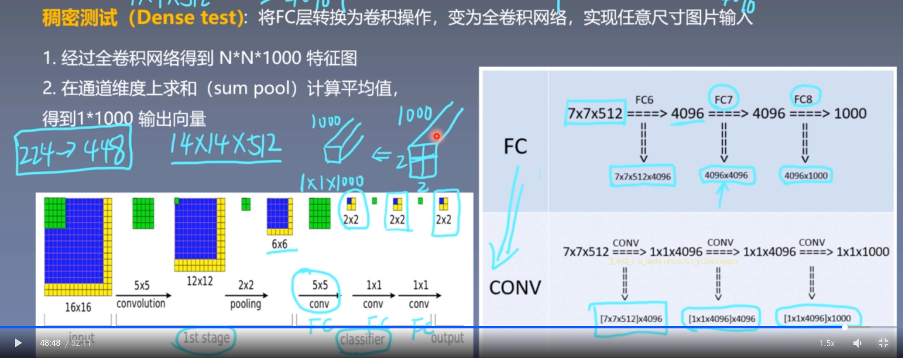

# Very Deep Convolutional Networks for Large-Scale Image Networks

# 一、Abstract

本文主要研究了在大规模图片识别背景下**卷积神经网络的深度对正确率的影响**。

使用带有$3\times3$的卷积核的结构对深度增加的网络进行整体评测，发现神经网络层数增加到16-19层表现会有明显提升。

# 二、Introduction

In this paper, we address another important aspect of ConvNet architecture design – its depth. we fix other parameters of the architecture, and steadily increase the depth of the network by adding more convolutional layers, which is feasible due to the use of very small (3×3) convolution filters in all layers。

# 三、ConvNet Configrations

## 1. Architecture

+ 卷积网络的输入是被调整到$224\times224$的RGB图像。
+ 唯一的预处理是计算训练集上的每个像素的RGB均值。
+ 图像被传递给一堆使用$3\times3$卷积核的卷积层。
+ 在一个设置中也使用了$1\times1$的卷积核，可以看作是一个对输入通道的线性转换，后接一个ReLU激活层。
+ 卷积层的步长都是1。
+ 使用padding来保证图片大小在卷积之后不变，所以对使用$3\times3$卷积核的卷积层，padding为1。
+ 在一些卷积层后有池化层，一共有5层池化层，每个池化层的窗口大小为$2\times2$，步长为2。
+ 在一堆卷积层之后是三层全连接层，前两层每层4096个通道，第三层是1000通道的，用于分类，最后一层是soft-max层。
+ 第一层卷积层的输出通道数为64,之后每层乘2。

在实验中发现AlexNet中的LRN没啥效果还浪费内存和计算时间。

## 2. Configurations

各个方案的网络结构配置，略。

## 3. Discussion

很容易发现，两层$3\times3$的卷积层(中间没有池化)，与$5\times5$卷积核效果一样，三层$3\times3$的卷积层与使用$7\times7$卷积核等价。

3层$3\times3$卷积核的卷积层和一层$7\times7$卷积核的卷积层相比：

+ 使用多层非线性修正层，**让决策函数识别能力更强**。
+ **参数更少**。假设卷积层的输入输出都是C通道，那么3层$3\times3$卷积核的卷积层$3(3^2C^2)=27C^2$，$7\times7$卷积层$49C^2$。

$1\times1$卷积核的卷积层能够增加决策函数的非线性而不影响卷积层的感受野。

# 四、Classification Framework

## 1.Training

卷积层的训练流程和AlexNet差不多，除了对输入图片的采样是从多个尺寸的训练图片中裁剪得到的。

训练是通过使用mini-batch 梯度下降法和动量来优化多项式logistic regression目标函数，batch大小设置为256,动量0.9。

训练是通过权值衰减来正则化的，使用L2作为惩罚函数，系数$5\times10^{-4}$，全连接层前两层又dropout层，随机失活的概率为0.5。

学习率初始化设置为0.01，之后当验证集准确率停止提升时每次除以10。总的来说，学习率会降低3次，然后学习过程会在370K次迭代之后停止(74 epochs)。

我们猜测尽管和AlexNet相比我们的网络参数数量更多，更深，但是我们的网络需要更少的epoch来拟合，因为：

+ **更深的网络和更小的卷积核**进行了不明显的正则化。
+ **对网络层进行权值初始化**。

每次SGD迭代随机从每张缩放后的图片截取$224\times224$区域，为了进一步增强数据集，截取的区域经历了**随机水平翻转和随机颜色变换**。

**关于图片大小**：设**$S$为按比例缩放后的训练图片的最小的边**，卷积网络的输入就是从这训练图片上**随机截取**的，因此也将S称作训练大小，尽管截取区域的大小为$224\times224$，但是原则上S获取的数据不比224少，因为S<224时就进行放大，S=224时，那么截取的区域可以获得整个图片的数据，完全占据了训练图片的短边，对$S>>224$，截取的区域对应于图片的一小部分，包含一些小物体或物体的一部分。

我们考虑两种设置训练大小S的方法：

+ 第一种是**固定S**，对应单一大小的训练(note that image content within the sampled crops can still represent multi-scale image statistics).在我们的实验中，我们评价了在两个调整大小下训练的模型，**S=256和S=384**.首先是训练S=256的，然后使用S=256预训练的权值来初始化S=384的，这时使用的学习率降为0.001。
+ 第二种是设置S为**多尺度训练**，每个训练图片被从范围$[S_{min},S_{max}]$中随机采样的S独立缩放。因为图像中的目标可能是多种大小的，这又利于将这一点在训练过程中考虑。这也可以看作是尺寸微调的数据增强，这里一个模型被训练用来识别不同尺寸的物体。

## 2.Testing

### (1)多尺度测试

首先，将输入图片所放到预定义的最小边，记做Q，也称作训练尺寸。Q不一定要和S相等。

+ 如果S固定，那么$Q\in[S-32,S+32]$。
+ 如果S随机，那么$Q\in (S_{min},0.5(S_{min}+S_{max}),S_{max})$。

#### [1] 稠密测试(Dense evaluation)

稠密测试(Dense evaluation)：将FC层转换成卷积操作，变成全卷积网络，实现任意尺寸图片输入，最终进行sum pool，得到$1\times1000$。(**dense evaluation的思想就是FCN和offset max-pooling结合。**)

然后，原先的**全连接层被替换为卷积层，这样能够不限制图片的大小，因为最终会输出一个$H\times W\times N$的score map，然后对$H\times W$进行sum pool，其中H，W与输入图片相关，N是类别数，最终得到的是在某一类上的概率。**

> 第一个全连接层变成$7\times7$卷积核的卷积层，剩下两层全连接层变成$1\times1$卷积核的卷积层。最终的全卷积网络被应用到整张未裁剪的图片。结果是一个类别分数表，类别数和最后的通道数一样，还有一个依赖于图片大小的可变空间分辨率。最终，为了获得修改后的图片的类别分数向量，类别分数求和之后计算平均值。我们也通过水平反转来增强测试集，将原始图像和翻转图像的soft-max后验平均，以获得最终的图片分数。

> 1. 通过全卷积网络得到$N\times N\times 1000$特征图。
> 2. 在通道维度上求和(sum pool)，计算平均值。
>
> 
>
> 全卷积遇到原本应当是全连接层的地方，让卷积核大小等于$(H,W)$，我们要求$H=W$，使用的卷积核个数看情况。

因为全卷积网络被应用到整张图片上，不需要在测试时重复截取采样，这里实际上是因为**全卷积能够在一次前向传播中密集处理crop图片**。但是multi-crop可以和dense互补。

#### [2] Multi-Crop测试

Multi-Crop借鉴AlexNet与GoogLeNet，对图片进行Multi-Crop，裁剪大小为$224\times224$，并水平翻转1张图，缩放至3种尺寸，然后每种尺寸裁剪出50张图片,**这里用的是卷积层+全连接层。**通过网络预测，最后对所有结果平均。

> ###### multi-crop相当于padding补充0值，而dense evaluation相当于padding补充了相邻的像素值，并且增大了感受野。
>
> multi-crop存在重复计算带来的效率的问题。
>
> 但是实际上multi-crop优于dense，不过两者可以互补。

## 3. Implementation Details

多GPU训练。

# 五、Classification Experiments

 ## 1. Single Scale Evaluation

1. 我们注意到LRN没啥用，所以在更深的网络中就没用LRN。
2. 随着卷积网络深度的增加，分类错误率降低。并且，发现即使非线性修正单元有效，我们还是需要卷积核获得的感知野(至少$3\times3$)中的信息。
3. 训练时变化的尺寸可以让训练结果更好。

## 2. Multi-Scale Evaluation

测试时的尺寸变化，在测试图片的集中缩放版本上跑模型对应不同的Q，后面跟着结果类别的后验平均，考虑到训练集与测试集的尺寸差异较大的话会使表现降低，所以$Q\in\{S-32,S,S+32\}$，同时，训练阶段的尺寸变化允许网络在测试时被用到更大的尺寸上，因此使用$S\in[S_{min},S_{max}]$中的变量来训练的模型，在更大范围的尺寸$Q=\{S_{min},0.5(S_{min}+S_{max}),S_{max}\}$上被评估。

结果表示，在测试阶段的尺寸微调可以让模型表现更好。

## 3. Multi-crop evaluation

using multiple crops performs slightly better than dense evaluation,and the two approaches are indeed complementary, as their combination outperforms each of them。

## 4. ConvNet Fusion

模型融合可以获得更好的表现，因为模型之间的互补性。

## 5.Comparison with the State of Art

加深的卷积网络成为了几乎最好的结构，除了GoogleNet在分类上正确率更高。

# 六、Conclusion

卷积网络的深度有利于提高分类准确度。

> VGG耗费更多计算资源，并且使用了更多的参数（这里不是3x3卷积的锅），导致更多的内存占用（140M）。其中绝大多数的参数都是来自于第一个全连接层。VGG可是有3个全连接层啊！
>
> PS：有的文章称：发现这些全连接层即使被去除，对于性能也没有什么影响，这样就显著降低了参数数量。
>
> 
>
> 注：很多pretrained的方法就是使用VGG的model（主要是16和19），VGG相对其他的方法，参数空间很大，最终的model有500多m，AlexNet只有200m，GoogLeNet更少，所以train一个vgg模型通常要花费更长的时间，所幸有公开的pretrained model让我们很方便的使用。

> commodity: 有价值的东西，商品
>
> utilise：利用
>
> incorporate:合并
>
> discriminative：有识别力。
>
> conjecture: 推测，猜测
>
> circumvent：规避
>
> isotropically：各向同性
>
> denote：表示，意味着
>
> Fusion：融合
>
> complementarity：互补性