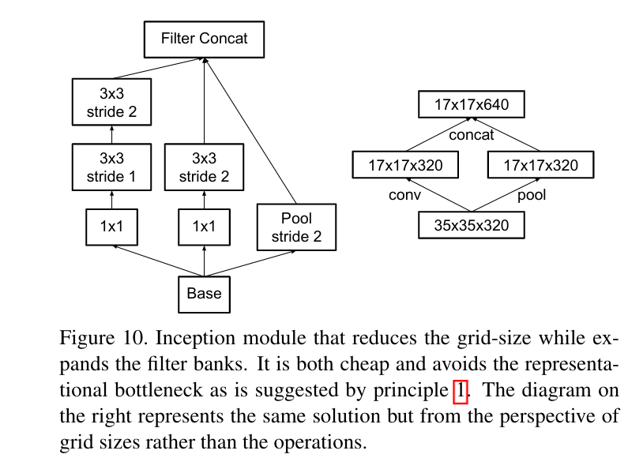
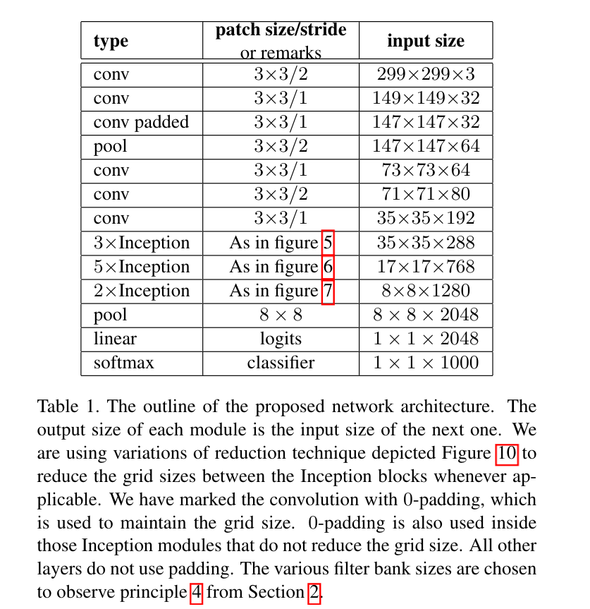

# Rethinking the Inception Architecture for Computer Vision

> enabling : 对... 有积极意义
>
> reliant：依赖性的
>
> compelling：强迫的、不可抗拒的
>
> inherently：固有地
>
> mitigate：减轻、缓和
>
> deem：认为
>
> speculative：推测的、猜测的
>
> deterioration：恶化、退化
>
> disentangled：分清，清理出
>
> aggregation：聚合
>
> disentangled：解开的
>
> exploit：利用，剥削，开发
>
> tile：瓦片
>
> conjecture：猜测，推测
>
> marginalize：边缘化
>
> intuitively：直观地
>
> replica：复制品
>
> clip：剪裁

# 0. Abstract

尽管增大的模型大小和计算代价往往能转变成多数任务的直接质量提高(只要有足够的标记数据用于训练)，**计算效率和低参数数量**依然是许多应用场景的积极因素，比如移动视觉和大数据场景。

> Although increased model size and computational cost tend to translate to immediate quality gains for most tasks (as long as enough labeled data is provided for training),  **computational efficiency and low parameter**  count are still enabling factors for various use cases such as mobile vision and big-data scenarios.

我们正在探索了用来放大网络的方法，该方法旨在尽可能**有效地利用增加的计算**，通过合适地**分解的卷积和激进的正则化**。

>  Here we are exploring ways to scale up networks in ways that aim at utilizing the added computation as efficiently as possible by suitably factorized convolutions and aggressive regularization.

# 1. Introduction

从AlexNet到VGG net，GoogLeNet，这些用于图像分类的网络结构的改变往往能在其他领域获得重大的质量提高。这意味着**深度卷积网络结构的提高能够被用来提高其他越来越依赖于高质量、可学习视觉特征的计算视觉任务**。此外，网络质量的提升带来了原先AlexNet无法与人类抗衡的新的应用领域。

VGG虽然有吸引人的简洁架构特点，但是代价太高，评估网络需要许多计算量。而GoogLeNet架构被设计用于在即使有着严格限制的内存和计算开销的场景。

**Inception的计算开销远小于VGGNet或其表现优秀的后继者。**这使得Inception可以应用在**大数据场景**、**内存和计算资源受限的**移动计算场景等。当然使用一些特定的解决方案来达到目标内存使用量、或通过计算技巧来优化特定操作的执行。但是这些方法增加了额外复杂度，此外，这些方法也可以用于优化Inception架构。

**然而，Inception架构的复杂性使得很难对网络进行修改。**如果天真地放大架构，很大一部分计算收益可能会立即丢失。并且原先没有提供对GoogLeNet设计决定的关键因素的清晰描述。使得很难将其调整到新的应用场合，同时还保持其有效性。

In this paper,  we start with describing **a few general principles and optimization ideas** that that proved to **be useful for scaling up convolution networks in efficient ways**. 

Although our principles are not limited to Inception-type networks, they are easier to observe in that context as the generic structure of the Inception style building blocks is flexible enough to incorporate those constraints naturally.

# 2. General Design Principles

1. 在网络早期，避免代表性的瓶颈。

   > Avoid representational bottlenecks, especially early in the  network. 

   应当**避免急剧压缩的瓶颈**。总体来说，**表示尺寸**应当在到达最终的表示之前从输入到输出**缓慢地减小**。

   > One should **avoid bottlenecks with extreme compression**.  In general the representation size should gently decrease from the inputs to the outputs before reaching the final representation used for the task at hand.  

2. **更高维度的表示**更容易在网络内本地处理。

   > Higher dimensional representations are easier to process locally within a network. 
   >
   > Increasing the activations  per  tile  in  a  convolutional  network  allows  for more  disentangled  features.   The  resulting  networks will train faster.

3. **空间聚合**能够在**低维的嵌入**上进行，而不会损失表示能力。

   > Spatial  aggregation  can  be  done  over  lower  dimensional  embeddings  without  much  or  any  loss  in  representational power.

   我们假设原因是**相邻单元的强大联系带来了维度归约时更少的信息损失**，如果输出备用在空间聚合上下文。

   > We hypothesize that the reason for that is the strong correlation between adjacent unit results in much less loss of information during dimension reduction,  if the outputs are used in a spatial aggregation context.

4. **平衡网络的深度和宽度**。

   > Optimal performance of the network can be reached by **balancing  the  number  of  filters  per  stage  and  the  depth  of the network.**

   同时增加网络的深度和宽度可以带来高质量的网络，如果并行增加深度、宽度，则可以达到最佳改进，计算预算也会因此在网络的深度和宽度之间以平衡的方式分配。

这些设计原则可能是合理的，未来还需要更多的实验证据来评价他们的准确率。

# 3. Factorizing Convolutions with Large Filter Size

GoogLeNet v1网络的原创性收获来自于**对维度归约的普遍使用**。这可以看作是**以一种计算高效的方式分解卷积的特殊情况**(就是$1\times1$卷积的使用)。

> Much  of  the  original  gains  of  the  GoogLeNet  network arise from a very generous use of dimension re-duction. This can be viewed as a special case of factorizingconvolutions in a computationally efficient manner.

在视觉网络中，可以预料到**附近的激活值的输出是高度相关的**。因此，我们可以预料到它们的**激活值能够在聚合之前减少**，这应当能够带来类似的局部表现。

**分解卷积**的主要目的是**提高计算效率**。因为Inception网络是全卷积的，所以卷积中的每个权重对应每个激活值一个乘积。因此，任何**计算代价的减少带来参数的减少**。这意味着使用合适的分解，我们能以更多分清的参数结束，因此获得更快的训练。此外，我们可**以使用节省的计算和内存来增大卷积核大小**，同时保持我们在一台计算机上训练每个模型副本的能力。

## (1) Factorization into smaller convolutions

大卷积核往往会有不成比例的计算代价，虽然大卷积核能够在早期获取到激活值附近单元的依赖，而在VGG中已经证明了小卷积核叠加可以代替大卷积核，并且给出了精确的计算减少比例。

但是，这也引发了两个普遍问题：

+ 小卷积核代替大卷积核是否导致了表示能力的缺失？

+ 如果我们我们的主要目标是分解计算中的线性部分，是否不建议在第一层保留线性激活？

  > 在在实验中发现，使用线性激活函数总是劣于在分解的所有阶段使用ReLU。
  >
  > 我们将这收获归功于增加的网络学习的变量空间，尤其是我们batch normalize 输出的激活值。
  >
  > 在维度归约组件使用线性激活函数也会看到类似的结果。

  

## (2) Spatial Factorization into Asymmetric Convolutions

将卷积分解成非对称卷积，比如将$3\times3$卷积分解成$3\times1$卷积接$1\times3$卷积，还可以减少$33\%$的计算量。理论上我们可以分解$n\times n$的卷积为$n\times1$接$1\times n$卷积，随着n的增加，计算量大幅减少。在实践中，发现**在早期网络层使用这种分解效果并不好，但是在中等大小网络($m\times m$特征图，$m\in [12,20]$)表现很好。**此时使用$7\times1,1\times7$卷积效果较好。

# 4. Utility of Auxiliary Classifiers

辅助分类器用来**提高深度网络的拟合能力**。最初的动机是将有用的梯度加到低层网络层，使其能够立即有用并通过**处理深度网络的梯度消失问题**来提升训练阶段的拟合。

我们发现，辅助分类器在训练早期并没有带来拟合的提升：在模型到达较高准确率前，带有和不带有side head的网络的训练过程几乎完全一样。**在训练的结束阶段，有辅助分支的网络开始比没有辅助分支的网络准确率略高**。

GoogLeNet v1在网络中的不同阶段使用了两个side-head。**移除低层的辅助分支对网络的最终结果的质量没有任何副作用**，这说明原先**认为这些分支有助于进化低级特征的假设可能是错误的**。

我们认为**辅助分类器作用类似正则化器**，因为网络的主分类器能够表现得更好，如果side branch是batch-normalized或者有dropout层。因为batch normalization作用类似正则化器，这提供了微弱的支持证据。

# 5. Efficient Grid Size Reduction

卷积网络会使**用池化操作来减少特征图的方格大小**。为了避免表示的瓶颈，在使用最大/平均池化前扩大网络卷积核的尺寸。

> 从$d\times d$的网格和k个卷积核，如果我们要抵达$\frac{d}{2}\times\frac{d}{2}$和$2k$个卷积核，我们首先需要计算具有$2k$个卷积核的卷积操作，然后应用池化操作，但是这样需要进行$2d^2k^2$次操作。另一种可能是先池化后卷积，需要进行$2(\frac{d}{2})^2k^2$次操作，但是这样带来了表现上的瓶颈，因为表现上的整体的维度降到了$(\frac{d}{2})^2k$，导致网络表示能力的减少。

我们建议另一种减少计算代价并且移除了表示瓶颈的变种。我们可以使用两个平行的步长为2的块P，C。P是池化层，C是卷积层。

即，**用卷积得到一半特征图，用池化得到一半特征图。**

# 6. Inception-v2

# 7. Model Regularization via Label Smoothing

> 传统的one-hot编码的问题：过度自信，导致过拟合。
>
> 提出标签平滑，把概率为1的那一项进行衰减，避免过度自信，衰减的那部分confidence平均分配到没一个类别。

Label Smoothing Regularization (LSR)：the change depicted below in ground-truth label distribution.

对每个训练样例x，我们的模型计算每个标签的概率$k\in \{1...K\}:p(k|x)=\frac{\exp(z_k)}{\sum_{i=1}^K\exp(z_i)}$。这里，$z_i$是对数或者没有正则化的log-probabilities。考虑到训练样本的标签$q(k|x)$在ground-truth的分布，正则化使得$\sum_k q(k|x)=1$。损失函数用交叉熵$\ell=-\sum_{i=1}^K\log(p(k))q(k)$。最小化该损失函数等价于最大化标签的log似然函数，这里标签是根据基准事实的分布$q(k)$选择的。交叉熵对$z_k$可微，梯度计算公式：
$$
\frac{\part \ell}{\part z_k}=p(k)-q(k)
$$
梯度在$[-1，1]$的范围内。

考虑单个基准事实标签y，$q(y)=1,q(k)=0,\forall k\neq y$。对特定的样例x和标签y，$q(k)=\delta_{k,y}=\left\{\begin{matrix}0,k\neq y\\ 1,k=y\end{matrix}\right.$。

This maximum is not achievable for finite $z_k$ but is approached if $z_y>>z_k$ for all $k\neq y$ – that is, **if the logit corresponding to the ground-truth label is much great than all other logits**.

 这会带来两个问题：

+  First, it may result in **over-fitting**。
+ Second, it encourages the differences between the  largest  logit  and  all  others  to  become  large,  and  this, combined with the bounded gradient $\frac{\part \ell}{\part z_k}$, **reduces the ability of the model to adapt**. 

Intuitively, this happens because **the model becomes too confident about its predictions**.

解决方案：Label Smoothing Regularization。

设与训练样本x无关的关于标签$u(k)$的分布，以及光滑参数$\epsilon$。对事实标签为y的训练样本x，将标签分布替换为：
$$
q^{'}(k|x)=(1-\epsilon)\delta_{k,y}+\epsilon u(k)
$$
这是最初事实分布的分布$q(k|x)$和固定分布$u(k)$的混合，权重分别为$(1-\epsilon),\epsilon$。一般$u(k)$使用均匀分布。

新的交叉熵损失函数：
$$
H(q^{'},p)=-\sum_{i=1}^K \log p(k) q^{'}(k)=(1-\epsilon)H(q,p)+\epsilon H(u,p)
$$

> The second loss penalizes the deviation of predicted label distribution p from the prior u, with the relative weight $\frac{\epsilon}{1-\epsilon}$.
>
> 注意该偏差也可以通过KL散度获得。

# 8. Training Methodology

损失函数：交叉熵

优化器：SGD

batch size：32

epoch：100

momentum：decay 0.9

> 实验最好的momentum的decay为0.9，$\epsilon=1.0$。

学习率：0.045，每2个epoch，$lr=(lr)^{0.94}$。

n addition, gradient clipping with threshold 2.0 was found to be useful to stabilize the training。

# 9. Performance on Lower Resolution Input

在目标检测算法中，需要对图片中包含单个目标和一些上下文的小块进行分析，但是这些目标往往是小、分辨率低的，这就引出了如何正确地处理低分辨率输入的问题。

经过实验，发现低分辨率的图片虽然要更多的时间来训练，但是结果的质量和高分辨率的非常接近。

> We have also demonstrated that high quality results can be reached with receptive field resolution as low as79×79.
>
> **==高效降低特征图分辨率。==**
>
> This might prove to be helpful in systems for detecting relatively small objects.

但是，如果仅仅天真地根据输入的分辨率减小网络的大小，那么网络表现会变差。

# 10. Experimental Results and Comparisons

就是不同结构的网络，加上不同的正则化方法后进行比较。

# 11. Conclusions

1. We have studied how **factorizing convolutions** and **aggressive dimension reductions** inside neural network can result in networks with relatively **low computational cost** while **maintaining high quality**. 

2. We have also demonstrated that high quality results can be reached with receptive field resolution as low as 79×79.

   This might prove to be helpful in systems for detecting relatively small objects.

3. The combination of **lower parameter count** and additional regularization with **batch-normalized auxiliary classifiers** and **label-smoothing** allows for training high quality networks on relatively modest sized training sets.

