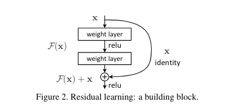
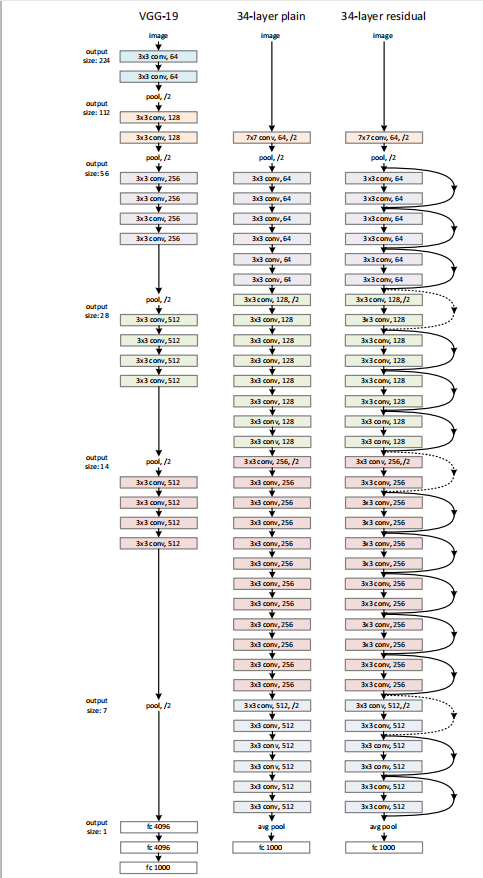
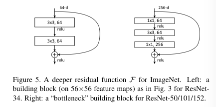

# Deep Residual Learning For Image Recognition

# 一、Abstract

本文提出了残差学习框架用来使非常深的网络的训练变得容易。

我们**显式地将层变成关于层输入的残差函数**，而不是学习未参考的函数。

>  We explicitly reformulate the layers as learning residual functions with reference to the layer inputs, in stead of learning unreferenced functions.

我们提供了全面的经验证据显示这些**残差网络更容易优化**，并且能够**通过显著地增加深度来提高准确率**。

在ImageNet数据集上，我们评价了有152层深度的残差网络，其复杂度比VGG net要低。

> **The  depth  of  representations  is  of  central  importance for  many  visual  recognition  tasks**

# 二、Introduction

深度网络很自然地将低/中/高层次的特征和分类器以段到段多层的方式进行集成，特征的层次能够随着堆叠的层的深度增加而增加。**(网络的深度很重要)**.

>  Deep networks naturally integrate low/mid/high-level  features and  classifiers  in  an  end-to-end  multi-layer fashion, and the “levels” of features can be enriched by the number of stacked layers (depth).

在深度的重要性的驱动下，一个问题产生了：**模型是否能够像网络层数增加那样容易地提高学习效果**？**梯度消失和梯度爆炸**这两个会从一开始阻碍拟合的问题，**已经被正则初始化参数和中间的正则化层解决了**，这使得有数十层的网络能够使用SGD和反向传播开始拟合。

当更深的网络开始拟合，一个退化问题就产生了：**随着网络深度的增加，准确率变得饱和，然后就会快速退化**。这退化并不是过拟合导致的，并且增加更多的网络层到合适的深度模型上会导致更高的训练误差。

训练准确率的退化表明了不是所有系统都是那么容易去优化。

> The degradation (of training accuracy) indicates that not all systems are similarly easy to optimize. 

考虑一个浅层的模型和其对应的增加了很多网络层的深层的对手。这里有一个通过构造解决深度模型的方法：**增加的网络层是恒等映射(identity mapping)，其他层是从浅层的模型拷贝过来的**。这种构造出来的解决方法表明深层模型应当不会产生比浅层模型更高的训练误差，但是实验表示目前的解决方法还没能找到能够和这个构造的方法相比甚至更好的方法。

>  The existence of this constructed solution indicates that **a deeper model should produce no higher training error than its shallower counterpart.**

我们显式地让这些网络层拟合一个残差映射，而不是希望每个堆叠的网络层直接拟合一个希望的隐藏的映射。形式上，我们**将隐藏映射表示为$\mathcal{H}(x)$，让堆叠的非线性层拟合另外一个映射$\mathcal{F}(x)=\mathcal{H}(x)-x$，那么原来的映射是$\mathcal{H}(x)=\mathcal{F}(x)+x$。**

> We hypothesize that it is easier to optimize the residual mapping than to optimize the original, unreferenced mapping.  To the extreme, if an identity mapping were optimal, it would be easier to push the residual to zero than to fit an identity mapping by a stack of nonlinear layers.

这个可以在前馈神经网络中使用**快捷连接(shortcut connection)**来实现，这里的快捷连接仅仅执行恒等映射，它们的输出会加到堆叠的网络层的输出上。这不需要任何额外的参数和计算复杂度。

我们在ImageNet上进行了复杂的实验来展示退化问题，并评价了我们的方法：

+ 我们的特别深的残差网络很容易优化，但是对手plain net随着网络深度的增加显示更高的训练误差。
+ 我们的深度残差网络能够很容易从增加的深度上获得正确率的提高，产生比之前网络更好的结果。

相似的结果在其他数据集和任务上出现，表明了深度残差网络具有很好的泛化能力。

# 三、Related Work

## 1. Residual Representation

在图像识别领域，VLAD是一种和字典相关的由残差向量编码的表示， Fisher vector是VLAD的概率版本。这两者都是图像检索和图像分类的强大浅层表示。对于向量的量化，编码残差向量被证明比编码原始向量更有效。

在低级视觉和计算机图形学，为了解决PDE，广泛使用的Mutigrid method在不同尺度将系统重构为子问题，每个子问题负责较粗尺度和较细尺度的残差解。Multigird的一个替代方法是hierarchical basis preconditioning，这依赖于表示两个尺度的残差向量的变量。已经证实这些求解器比不知道残差性质的标准求解器收敛得更快。

## 2. Shortcut Connections

快捷连接的理论与实践已经被研究了很长时间。早期的实践是训练多层感知机，通过添加一个线性层来链接网络的输入与输出。后面的研究中，一些中间层直接连接到辅助分类器，用于解决梯度消失/爆炸。有论文提出了通过快捷连接实现层间响应，梯度和传播误差的方法。

和我们同时进行的工作，”highway networks“提出了门功能的快捷连接，这些门是数据相关且有参数的。

# 四、Deep Residual Learning

## 1. Residual Learning

考虑一堆网络层要学习的映射$\mathcal{H}(x)$，x是这堆网络层的第一层的输入，假设最终的输出$\mathcal{H}(x)$和x形状相同，那么就变成学习$\mathcal{F}(x)=\mathcal{H}(x)-x$，而原来的就是$\mathcal{H}(x)=\mathcal{F}(x)+x$，虽然看上去没啥区别，但是学习的容易度不一样。

这个重构受到违反直觉的退化问题启发。如果增加的网络层被构造成恒等映射，那么深度模型的训练误差应当不会比浅层的高。退化问题显示解决器可能在使用非线性层拟合恒等映射上有困难。如果横等映射是最佳的，解决器可能驱使多层非线性曾的权值变成0来接近恒等映射。

在实际场景，不可能恒等映射是最佳的，但是我们的重构可能帮助预先处理问题。如果最佳的函数接近恒等映射而不是0映射，解决器会更容易找到与恒等映射有关的前提条件，而不是学习一个新的函数。

经过实验发现恒等映射提供了相当合理的先决条件。

## 2. Identity Mapping by Shortcuts

Define a building block:
$$
\mathrm{y}=\mathcal{F}(\mathrm{x},\{W_i\})+\mathrm{x}
$$
$\mathrm{x,y}$是这堆网络层的输入和输出，函数$\mathcal{F}(\mathrm{x},\{W_i\})$表示要学习的残差映射。

上图有两层网络层：
$$
\mathcal{F}=W_2\sigma(W_1\mathrm{x})
$$
这里$\sigma$表示ReLU，为了简化符号，偏置bias被忽略。$\mathcal{F}+x$操作由一个快捷连接和逐元素相加执行。

这里的快捷连接不会引入参数和计算复杂度。

> The shortcut connections in Eqn.(1) introduce neither extra parameter nor computation complexity.

**$\mathrm{x}$和$\mathcal{F}$必须具有相同维度，如果不是(改变了输入输出的通道)，我们可以执行一个线性投影$W_s$来匹配维度：**
$$
\mathrm{y}=\mathcal{F}(\mathrm{x},\{W_i\})+W_s\mathrm{x}
$$
**$W_s$仅仅用来使得维度匹配，$\mathrm{x}$和$\mathcal{F}$具有相同维度的话不需要使用方阵，因为恒等映射已经足够。**

> 一层的残差网络$y=W_1x+x$，跟没有一样。。。

**残差函数也可以用来表示多个卷积层，逐通道地对两个特征图执行逐元素加法**。

> We also note that although the above notations are about fully-connected layers for simplicity, they are applicable to convolutional layers.  **The function $F(x,{W_i})$ can represent multiple convolutional layers.  The element-wise addition is performed on two feature maps, channel by channel.**

## 3. Network Architectures

### (1) Plain Network

朴素网络的baseline受到VGG net的哲学启发。卷积层大部分使用$3\times3$的卷积核，并且遵循**两个设计准则**：

+ **输入输出的feature map大小相同的网络层，卷积核的数量相同**，即输入、输出通道数相同。
+ **如果feature map大小减半，那么卷积核数量翻倍**，这样可以保持每层的时间复杂度。

我们**直接通过步长为2的卷积层进行降采样**，网络最终会以average pooling layer和1000-way的全连接层和softmax结尾。带权值的网络层一共34层。

这里使用的模型拥有比VGG更少的卷积核和更低的复杂度。

### (2) Residual Network

基于上面的朴素网络，插入快捷链接，就实现了残差网络。当输入与输出的维度相同，恒等映射快捷链接可以直接使用。当维度增加，我们考虑两个选项：

+ **快捷连接仍然执行恒等映射，增加的维度会使用0填充**。
+ **进行线性投影来匹配维度(用$1\times1$的卷积)。**

当快捷连跨越了两个大小的feature map时，这两个选项都需要进行步长为2的降采样。

## 4. Implementation

实现时，图片会根据其短边进行缩放，然后在$[256,480]$中随机采样，用于尺度增强。

从图片或者其水平翻转中随机截取$224\times224$的区域，每个像素要减去均值。

使用了AlexNet中的标准颜色增强。

我们在每个卷积层后和激活函数前加入BN层。

采用kaiming初始化。

使用SGD作为优化器，mini-batch为256。

学习率从0.1开始，当错误率不变时除以10,模型迭代训练$60\times10^4$次。

权值衰减为0.0001，动量为0.9。

没有使用dropout。(毕竟没有全连接层)

测试时，为了比较研究，我们采用了标准的10-crop测试。关于最好的结果，我们采用了全卷积网络，对多尺度的得分进行平均(图片进行缩放，短边在$\{224,256,384,480,640\}$)。

# 五、Experiments

## 1. ImageNet Classification

### (1) Plain Networks

评价18层和34层的朴素网络，发现更深的34层朴素网络比18层的验证误差更大。为了揭示原因，我们比较了它们在训练过程中的训练/验证误差。发现34层的朴素网络在整个训练过程中的训练误差更大，即使18层朴素网络的解空间是34层的子集。

我们认为这种优化困难不可能是由梯度消失引起的。这些朴素网络使用BN训练，这使得前向传播信号方差非零。我们也证实了反向传播时使用BN梯度表现很好。所以不是前向传播和反向传播的梯度小时问题。

事实上，34层朴素网络依旧能获得可比较的准确率，我们推测深层朴素网络可能有指数低的收敛速度，这影响了训练误差的减少。这种优化困难在将来会继续研究。

### (2) Residual Networks

接下来评价18层和34层的残差网络。基线的结构和上面朴素网络一样，除了每副$3\times3$的卷积核都有一个快捷连接。在最开始比较的时候，所有快捷连接使用恒等映射，多出的维度用0填充，所以和使用线性投影相比没有多余的参数。

34层的残差网络展示了更低的训练误差，并且在验证数据上泛化很好。这表明退化问题在残差网络中被很好地解决了，我们通过增加深度来获取更高的准确率。

18层的朴素网络和残差网络正确率差不多，但是残差网络收敛更快，这使得优化变得容易。

### (3) Identity vs. Projection Shortcuts

已经证实了没有多余参数的恒等映射的快捷连接有助于训练。接下来调查投影快捷连接，比较三个选项：

+ A:增加的维度使用0填充，所有的快捷连接是没有参数的。
+ B:维度增加时使用投影映射的快捷连接，其他的是恒等映射的快捷连接。
+ C:所有的快捷连接都使用投影映射。

这三个选项都比朴素网络表现好，但是B比A表现稍好，我们认为这是因为A中填充的0事实上没有进行残差学习。C稍微比B好，我们将这归功于引入的多余的参数。但是这点差距无伤大雅，我们还是用A，可以减少时间、空间复杂度。

### (4) Deeper Bottleneck Architectures

下面描述用在ImageNet上的更深的网络。因为我们关心能够负担的训练时间，我们将构造的块修改成了瓶颈设计样式。对每个残差函数$\mathcal{F}$，我们使用3层堆叠而不是两层，这三层的卷积核是$1\times1,3\times3,1\times1$，这里$1\times1$的层负责归约，然后增加唯独，使得$3\times3$的层瓶颈有着更小的输入输出维度。

没有多余参数的设计对瓶颈结构尤其重要，如果使用恒等映射的快捷连接被投影的替代了，那么时间复杂度和模型大小都会翻倍，因为快捷连接用来链接两个高维端。因此恒等映射给瓶颈设计带来了更过有效的模型。

### (5) 50-layer ResNet

在34层残差网络中将2层的块替换成3层的瓶颈块就得到了50层的残差网络。

### (6) 101-layer and 152-layer ResNet

使用更多的3层瓶颈结构来构造101层和152层的残差网络。即使是152层的残差网络，其复杂度还是比VGG16/19低。而且50,101,152层的残差网络比34层的要明显更准确，这里还没有观察到退化问题。

### (7) Comparisons with State-of-the-art Methods

34层残差网络和最好的模型可以相比较，152层的直接吊打。不同深度的残差网络进行融合之后准确率更高。

## 2. CIFAR-10 and Analysis

网络的输入是$32\times32$的图片，每个像素减去均值。第一层是$3\times3$的卷积层。然后在大小为$\{32,16,8\}$feature map山使用$6n$层$3\times3$的卷积层，每个大小2n层。通过步长为2的卷积进行降采样。网络最后以全局平均池化，10路全连接层和softmax结尾。一共$6n+2$层网络层。

当使用快捷连接时，它们在成对的$3\times3$网络层之间连接，一共3n个快捷连接，这里使用的都是恒等映射快捷连接，因此残差模型和对应的朴素模型具有相同深度、宽度还有参数数量。

我们使用0.0001的权值衰减和0.9的动量，采用kaiming初始化来初始化权值，使用BN，但不用dropout。模型在两个GPU上训练，batch size 为128.学习率开始为0.1,在32k和48k次迭代时除以10,一共迭代64k次。采用的数据增强： pixels are padded on each side,and  a  32×32  crop  is  randomly  sampled  from  the  padded image or its horizontal flip。

比较$n=\{3,5,7,9\}$，带来$20,32,44,56$层的网络，在朴素网络中，随着深度的增加训练误差是增大的，这个现象和ImageNet和MINST上一样，表明这种优化困难是基础性的问题。残差网络可以克服这种优化困难。

在n=18，即110层的残差网络上发现0.1的学习率还是太大，以至于不能拟合，所以使用0.01的学习率直到训练误差降到80%以下(大概400次迭代)，然后回到0.1学习率，正常执行。

### (1) Analysis of Layer Response

层响应是每个使用$3\times3$的卷积层的输出，在BN层后，在非线性激活函数前。对于残差网络，这揭示了残差函数的响应强度。经实验发现，残差网络整体比朴素网络具有更小的响应，这些结果支持了残差函数可能比非惨差函数更接近于0的假设。

我们也注意到更深的残差网络具有更小的响应影响，当有更多的网络层，残差网络中的单个网络层往往会修改信号更少。

### (2) Exploring Over 1000 layers

超过1000层的残差网络的训练没有优化困难，能够获得很好的训练误差和测试误差，但是测试结果是比110层的残差网络差的。我们猜测是因为发生了过拟合。而且1202层的残差网络对于小数据集来说太大了，而且这里没有采用maxout和dropout正则化，仅仅通过深而薄的结构来进行正则化，没有从优化困难转移注意力。加上更强的正则化应当可以证明结果，这可以在未来进行研究。

## 3. Object Detection on PASCAL and MS COCO

深度残差网络在目标检测上也取得了相当好的表现。

> residual: 剩余的，残差
>
> ensemble：套
>
> empirical：经验的
>
> notorious：臭名昭著的
>
> hamper：阻碍
>
> degradtion：退化
>
> identity map：恒等映射
>
> shortcut：近路，捷径
>
> in a fashion：以...方式
>
> image retrieval: 图像分类
>
> coarser: 粗糙的
>
> **asymptotically：渐进地**
>
> counterintuitive：违反直觉的
>
> precondition：预先处理、前提、先决条件、
>
> notation：符号
>
> **projection：投影**
>
> conjecture：推测

