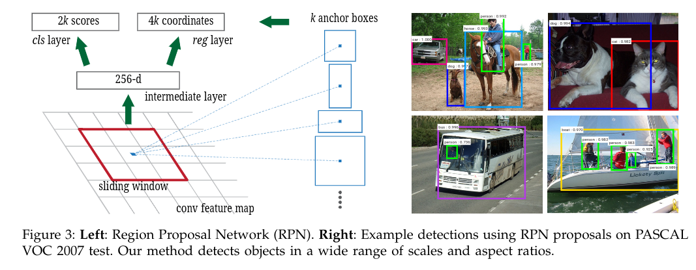

# Faster R-CNN: Towards Real-Time Object Detection with Region Proposal Networks

> terminology：术语
>
> down-stream：下游的
>
> R-CNN：Region-based CNN
>
> incarnation: 化身
>
> magnitude: 巨大的
>
> to this end：为此
>
> prevalent：流行的
>
> alternate：轮流、交替    轮流的、交替的 
>
> alternating：轮流的，交替的
>
> waive：放弃
>
> preliminary：初步的
>
> manuscript：手稿
>
> overfeat：大量的
>
> invariant: 不变的
>
> take place：发生
>
> derivative：衍生物
>
> nontrivial：不平凡的、不容易的

## 0. Abstract

效果最好的目标检测网络依赖于候选区域算法来猜测目标位置。

> State-of-the-art object detection networks depend on region proposal algorithms to hypothesize object locations.

SPPnet和Fast R-CNN的进步已经减少了这些目标检测网络的运行时间，暴露出**候选区域计算的瓶颈**。

本篇论文引入**候选区域网络(RPN, Region Proposal Network)，和目标检测网络共享整张图片的卷积特征**，因此使得候选区域几乎没有计算代价。

RPN是一个全卷积神经网络，能够同时预测目标边框和每个位置的置信度。

>  An RPN is a **fully convolutional network** that simultaneously predicts **object bounds** and **objectness scores** at each position.

RPN网络采用端到端训练来产生高质量的候选区域，用于目标检测。

我们进一步**将RPN和Fast R-CNN合并到一个网络中**，通过**共享卷积特征**(神经网络术语: **注意力机制, attention mechanism**)，RPN组件告诉整个网络要看的地方。

>  The  RPN  module  serves  as  the ‘attention’ of this unified network.

## 1. Introduction

尽管R-CNN系列的计算代价高昂，通过共享候选区域的卷积能够极大地减少计算开销。

**如果忽略掉在候选区域上的计算时间，Fast R-CNN使用非常深的网络能够获得接近实时的效果**。

 Now,  **proposals  are  the test-time  computational  bottleneck  in  state-of-the-art detection systems.**

> 候选区域方法依赖于非必要的特征和经济的方案。 ?
>
> Region  proposal  methods  typically  rely  on  inex-pensive  features  and  economical  inference  schemes.
>
> **Selective Search**， greedily merges superpixels based on engineered low-level  features。
>
>  **EdgeBoxes**， provides the best tradeoff  between  proposal  quality  and  speed。
>
> **the  region proposal  step  still  consumes  as  much  running  time as the detection network**.

通过在测试时共享卷积，计算候选区域的代价很小。

我们发现region-based detectors使用的卷积特征，也可以用于生成候选区域，在这些卷积特征上，我们通过**增加一些额外的卷积层**来同时**回归区域边界**和**在正常方格上每个位置的置信度**。

> On top of  these convolutional  features,  we **construct an RPN by adding a few additional convolutional layers** that simultaneously  **regress region bounds** and **objectness scores at each location on a regular grid**. 

### (1) RPN处理不同尺寸和细长比的候选区域

RPN被设计用来高效预测具有很大范围的尺寸和细长比的候选区域。

> RPNs are designed to efficiently predict region proposals with a wide range of scales and aspect ratios.

2016年那会流行使用图像金字塔、pyramids of filters来处理不同尺寸和细长比的候选区域。

Faster R-CNN**引入anchor box作为多尺度、细长比的参考**。

> we  introduce  novel  “anchor”  boxes that serve as references at multiple scales and aspect ratios.

## 2. Related Work

### (1) Object Proposals

广泛使用的目标候选区域方法包括：

+ **based on grouping super-pixels**: 

  Selective Research, CPMC, MCG

+ **based on sliding windows**:

  objectiveness in windows, EdgeBoxes

目标候选区域方法作为独立于目标检测器的外部模块被采用。

### (2) Deep Networks for Object Detection

R-CNN方法端到端训练CNN来将候选区域分类到目标种类或者背景。**R-CNN主要作为分类器，不预测目标边框**(除了通过bounding box regression微调)。**其准确率依赖于候选区域模块的表现**。

R-CNN采用MultiBox方法产生候选区域。但是**MultiBox方法不能在候选区域和检测网络之间共享特征**。

**Fast R-CNN允许端到端的检测器在共享的卷积特征上训练**，展现令人信服的准确率和速度。

> **shared computation of convolutions**: 
>
> OverFeat,   SSP (Adaptively-sized Pooling), Fast R-CNN

## 3. Faster R-CNN

Faster R-CNN由两个模块组成：

+ 产生候选区域的深度神经网络。
+ 使用候选区域的Fast R-CNN检测器。

### (1) Region Proposal Networks

A  Region  Proposal  Network  (**RPN**)  **takes  an  image (of any size) as input** and **outputs a set of rectangular object proposals**, each with **an objectness score**.

因为这里的终极目标是和Fast R-CNN检测网络共享计算，我们认为这**两个网络共享一个共同的卷积层集合**。

> 这里研究了具有5个可共享层的ZF网络和13个可共享层的VGG-16。

为了**产生候选区域**，我们**在共享的最后一层卷积层的输出卷积特征图上滑动小网络**。

> To  generate  region  proposals,  we slide a  small network  over the convolutional feature map output by  the last shared  convolutional  layer.

这个**小网络将输入卷积特征图的$n\times n$空间窗口作为输入**，这里$n=3$。

每个**滑动窗口被映射到一个低维特征**(ZF的是256-d, VGG的是512-d，跟着使用ReLU)。这个特征被送给两个全连接层：

+ **box-regression layer**
+ **box-classification layer**

**因为mini-network以滑动窗口形式操作，全连接层在所有空间位置共享**。

这个结构很自然地可以使用$n\times n$的卷积层接两个$1\times1$的卷积层(reg, cls)实现。

更具体的RPN网络结构：

正负样本判定：

#### [1] Anchors

> anchor实际上可以看作是先验边框，是根据经验人为地放置的一些边框。

在每个滑动窗口位置，我们同时预测多个候选区域，这里**每个位置的最大可能候选区域数量记做k**。

因此reg层有4k输出(k个box的坐标)，cls层输出2k个分数，评估每个候选区域存在目标和不存在目标的概率。

这k个候选区域即anchor。这里anchor位于滑动窗口的中心，与scale、aspect ratio相关。默认使用3个scale和3个aspect ratio，每个滑动窗口位置产生k = 9个anchor。

> $W\times H$的特征图会产生$WHk$个anchor。

**Translation Invariant Anchors**

即采用Anchor的方法是Translation Invariant的，即一个目标平移之后我们还能准确找到，而基于K-means聚类的MultiBox方法做不到。

**Multi-Scale Anchors as Regression References**

多尺寸预测的两个普遍方法：

+ **基于图片、特征金字塔** (DPM和基于CNN的方法)。图片缩放到不同尺寸，每个尺寸计算特征图。虽然高效，但是很耗时。
+ **在特征图上使用多个尺寸(多细长比)的滑动窗口**。DPM中使用不同卷积大小单独训练不同的细长比，如果这种方法被用来处理多个尺寸，可以认为是一个“**卷积核金字塔**”。

基于Achor的方法在anchor金字塔上建立。

> our anchor-based method is built on a  pyramid  of  anchors,  which  is  more  cost-efficient.

我们的方法根据多尺寸和细长比的anchor box来分类和回归bounding box。这**只依赖于单尺寸的图片和特征图，使用单尺寸的卷积核(特征图上的滑动窗口)**。

> 多尺寸anchor的设计是共享特征而没有处理尺寸的多余代价的关键组成部分。
>
> The  design  of  multi-scale anchors is a key component for sharing features without extra cost for addressing scales.

#### [2] Loss Function

训练RPN时，我们分配给每个anchor一个二进制分类标签，表示是否有目标。

我们给两类anchor分配正标签：

+ **和一个ground-truth有最高的IOU**的anchor
+ **和任意一个ground-truth的IOU大于0.7**的anchor

> 需要第一个条件是为了避免第二个条件不足以决定正样本。
>
> 一个ground truth可能分配正标签给多个anchor。

如果一个anchor和所有ground truth boxes的IOU小于0.3，分配负标签。

> 0.3-0.7中间的不起作用。

损失函数：
$$
L(\{p_i\},\{t_i\})=\frac{1}{N_{cls}}\sum_{i}L_{cls}(p_i,p_i^*)\\
+\lambda \frac{1}{N_{reg}}\sum_{i}p_i^*L_{reg}(t_i,t_i^*)
$$

+ 这里i是mini-batch中的一个anchor的索引，$p_i$是anchor i为目标的预测概率，如果anchor是正的，ground truth标签$p_i^*$是1，否则为0。

+ $t_i$是表示预测的bounding box的4个参数化坐标的向量， $t_i^*$是正anchor的参数化坐标的向量。

+ **分类损失$L_{cls}$是两类(含目标、不含目标)的log损失函数。**

+ **回归损失**$L_{reg}(t_i,t_i^*)=R(t_i-t_i^*)$，这里$R$是robust loss如**smooth L1**。

+ $p_i^*L_{reg}$意味着regression loss只在正anchor处激活，否则不被激活。

+ **cls和reg层的输出分别组成$\{p_i\}$, $\{t_i\}$**。 

+ 两项分别被$N_{cls},N_{reg}$正则化，通过平衡参数$\lambda$权衡。这里$cls$项被mini-batch大小正则化($N_{cls}=256$)，$reg$项被anchor位置数量($N_{reg}\sim2400$)正则化，默认设置$\lambda=10$，这样两项权重均衡。

  > 通过实验发现，结果对大范围的$\lambda$不敏感，以及上面做的正则化是不必要的，可以简化。

对于bounding box regression，采用下面的参数化4个坐标的方法：
$$
t_x=(x-x_a)/w_a,\quad t_y=(y-y_a)/h_a\\
t_w=log(w/w_a),\quad t_h=\log(h/h_a)\\
t_x^*=(x^*-x_a)/w_a,\quad t_y^*=(y^*-y_a)/h_a\\
t_w^*=log(w^*/w_a),\quad t_h^*=\log(h^*/h_a)\\
$$
这里$x,y,w,h$表示box的中心坐标和其宽度、高度。

$x,x_a,x^*$表示predicted box, anchor box, ground truth box的。

RPN的**box-classification layer预测的是anchor的坐标偏移**$(dx,dy,dw,dh)$。

因此，预测框和预测anchor偏移之间的关系：
$$
\left\{
\begin{matrix}
&gx=px+dx*pw\\
&gy=py+dy*ph\\
&gw=pw*\exp(dw)\\
&gh=ph*\exp(dh)
\end{matrix}
\right.
$$
$[px,py,pw,ph]$表示anchor的尺寸，$[dx,dy,dw,dh]$表示RPN网络预测的坐标偏移，$[gx,gy,gw,gh]$表示应用了坐标偏移后的anchor。

这可以认为是**从一个anchor box到附近ground truth box的bounding box regression**。

> 也就是学习anchor如何偏移到predict box，ground truth bounding box，**前4个公式与预测相关，后4个公式与监督相关**。

> Faster R-CNN使用和之前基于ROI的方法不同的方式获得bounding box regression。
>
> 基于ROI的方法中，bounding box regression在池化自随机尺寸的ROI上进行，regression权重被所有区域大小共享。
>
> 在Faster R-CNN中，用于regression的特征都是在特征图上的相同空间大小$3\times3$。
>
> 考虑到不同的尺寸，**k个bounding box regressor的集合被学习**。
>
> **每个regressor对一个scale和aspect ratio负责，这k个regressor不共享权重**。
>
> 多亏了anchor的设计，即使特征是固定尺寸的，仍然可以预测不同大小的box。

#### [3] Training RPNs

RPN使用SGD训练。遵循Fast R-CNN的“图像中心”采样策略来训练RPN网络。

>  follow the **“image-centric” sampling strategy** from Fast R-CNN to train this network.

每个mini-batch由单个包含许多正、负样本anchor的图片产生。优化所有anchor的损失函数是可能的，但是这回偏向负样本，因为负样本数量占据统治地位。

取而代之的，我们在一张图片上随机采样256个anchor来计算mini-batch的损失函数，这样采样的正负anchor比例在1：1， 如果正样本数量小于128, 剩下的用负样本填充。

我们通过在**$N(0, 0.01)$的正态分布**获取权重， 随机**初始化所有新的网络层**。

其他网络层使用在ImageNet上预训练的权重初始化。

> 训练细节：
>
> 前60K mini-batch，学习率0.001, 接下来的20K mini-batch， 学习率0.0001.
>
> momentum 0.9, weight decay 0.0005.

> **在RPN里，会将anchor进行二分类**：包含物体的前景，不包含物体的背景。

### (2) Sharing Features for RPN and Fast R-CNN

RPN和Fast R-CNN都是单独训练的，会用不同的方式调整它们的卷积层。因此我们需要开发在两个网络之间共享的卷积层，而不是学习两个单独的网络。

#### [1] Alternating training

首先训练RPN，然后使用候选区域训练Fast R-CNN，通过Fast R-CNN调整后的网络用于初始化RPN，迭代这个过程，这是本篇论文中用于所有实验的方法。

#### [2] Approximate joint training

训练时将RPN和Fast R-CNN合并到一个网络。在每一次SGD迭代，前向传播过程产生候选区域，这些候选区域被当作训练Fast R-CNN检测器的固定的、预先计算的候选区域。

反向传播过程中，共享卷积层接受来自RPN loss和Fast R-CNN loss的合并。
但是这个方法忽略了关于也是network reponse的候选框的坐标的衍生物。

> This solution is easy to implement. Butt his solution ignores the derivative w.r.t. the proposal boxes’  coordinates  that  are  also  network  responses,so  is  approximate.

在实验中发现该方法能够产生接近的结果，同时和alternate training相比减少了25% - 50%的训练时间。

#### [3] Non-approximate joint training

由RPN预测的bounding box是输入的函数，Fast R-CNN中的ROI池化层接受卷积特征和预测的bounding box作为输入，因此理**论上合法的反向传播solver应当包括和box坐标相关的梯度**。

这些梯度在Approximate joint training中被忽略了。**在non-approximate joint training中，要求ROI池化层关于box坐标可微**。

>  In a non-approximate joint training solution,we  need  an  RoI  pooling  layer  that  is  differentiable w.r.t. the box coordinates

这个问题可以通过"ROI warping"层解决，不过这篇论文没用这个。

#### [4] 4-step Alternating Training

本篇论文使用4-step的训练算法来通过交替优化学习共享的特征：

1. **训练RPN网络**，该RPN网络使用ImageNet预训练模型初始化，针对候选区域任务进行端到端的微调。

   > This network  is  initialized  with  an  ImageNet-pre-trained model  and  fine-tuned  end-to-end  for  the  region  proposal  task

2. **使用第一步的RPN产生的候选区域来训练单独的Fast R-CNN**。

   这个检测网络也是使用ImageNet预训练模型初始化。

   此时RPN和Fast R-CNN没有共享卷积层。

3. **使用检测器网络来初始化RPN训练，但是固定共享的卷积层，仅仅微调RPN独有的网络层**。

   现在两个网络具有共享卷积层。

4. **保持共享卷积层固定，微调Fast R-CNN独有的网络层**。

   这样，两个网络共享相同的卷积层，形成了一个统一的网络。

### (3) Implementation Details

Faster R-CNN训练和测试RPN，目标检测网络都是**基于单尺度图片**，将图片的**短边缩放到600像素**。

虽然使用图像金字塔的多尺度特征提取可能提高准确率，但是无法展现好的速度-准确率的权衡。

> ZF和VGG到最后一层的stride总计是16, 虽然stride很大，结果还是很好，尽管使用更小的stride可以提高准确率。

anchor的尺寸$128^2, 256^2, 512^2$，细长比$1:1, 1:2, 2:1$。

算法可以预测比底层感受野更大的区域，**如果只有目标的中间可见，算法可以粗略地推断目标的范围**。

> one  may  still roughly infer the extent of an object if only the middle of the object is visible.

**超出图片边界的anchor box需要仔细处理**。

+ **训练时，我们忽略所有超出图片边界的anhcor box**，这样它们不会影响损失函数。

  > 如果训练时超出图片边界的边框没有被忽略，它们给目标会引入巨大、难以纠正的错误项，训练无法收敛。

+ **测试时**，我们仍然使用全卷积RPN，这可能还会产生**超出边界的候选框，我们会将其截断**。

为了减少冗余，我们**对候选区域基于它们的cls分数采用NMS**，**固定IoU阈值0.7**(大概每张图片剩2000个候选区域), 之后**使用Top-N排序候选区域用于检测**。接下来：

+ 训练时，使用2000个候选区域训练Fast R-CNN。
+ 测试时，评价候选区域的不同数量。`?`

>  After  NMS,  we  use  the top-N ranked  proposal  regions  for  detection.  In  the following, we train Fast R-CNN using 2000 RPN pro-posals, but evaluate different numbers of proposals at test-time.

## 4. Experiments

### (1) Experiments on PASCAL VOC

### (2) Experiments on MS COCO

### (3) From MS COCO to PASCAL VOC

## 5. Conclusion

提出RPN用于高效、准确地生成候选区域。通过和下游的检测网络共享卷积特征，候选区域步骤几乎是没有计算代价的。

本文提出的方法使得一个统一的、基于深度学习的目标检测系统以**接近实时的帧率运行**。

学习的RPN网络也**提高了候选区域的质量**，因此**提高了整体目标检测的准确率**。