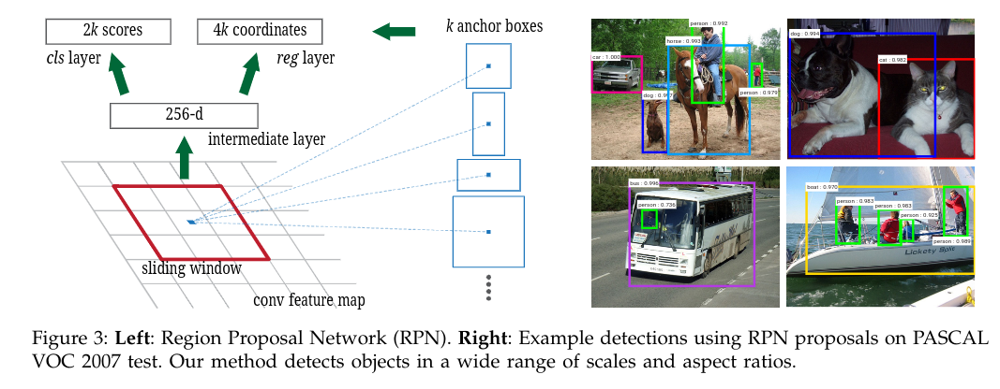

# Faster R-CNN模型组成分析与算法步骤

Faster R-CNN模型由：

+ **特征提取网络Backbone**： 可以是VGG、ResNet等网络结构中特征提取部分，提取得到特征图，这里的下采样率为16。

  如果VGGNet的输入图像维度$3\times600\times800$，因此输出特征图维度$512\times37\times50$。

+ **RPN模块**：RPN的作用是生成较好的候选区域，用到了强先验的Anchor。

+ **RoI Pooling**：接受**backbone提取的特征图**、**RPN的RoI**，将**RoI的特征池化到固定维度**，输出送到R-CNN网络。

+ **R-CNN模块**：将RoI Pooling得到的特征送入**全连接网络**，**预测每一个RoI的分类**，并**预测偏移量以微调边框位置**，并**计算损失**。

  主要包含3个部分：

  + **R-CNN全连接网络**：将得到的固定维度RoI特征送到全连接网络中，**输出**为R-CNN部分的**预测得分**和**预测回归偏移量**。
  + **计算R-CNN真值**：对于筛选出的RoI，确定是**正样本**还是**负样本**，同时**计算与对应真实物体的偏移量**。
  + **R-CNN Loss**：通过R-CNN的预测值和RoI部分的真值，**计算分类和回归Loss**。

组成。

## 一、特征提取网络

VGG，ResNet等网络的特征提取部分。

## 二、RPN模块

RPN包含**5个子模块**：

+ **Anchor生成**：RPN对feature map上每个点都生成了9个anchors，这9个anchors大小、宽高不同，对应到原图基本上可以覆盖所有可能出现的物体。同时这也是**可以根据先验知识调整**的地方。

  有了这些anchors，RPN接下来的工作是从中筛选，并调整出更好的位置，得到proposal。

+ **RPN卷积网络**：和上一步的anchor对应，因为特征图上每个点对应了9个anchor，因此可以**用$1\times1$卷积**在特征图上得到**每一个anchor的预测得分(是否包含物体)和预测偏移值**。

  

+ **计算RPN Loss**：将所有anchor和标签进行匹配，匹配程度较好的anchor赋予**正样本**：

  + 和ground truth box有最好IoU值的anchor。
  + 和任一ground truth box的IoU大于0.7的anchor。

  和所有ground truth box的IoU小于0.3的anchor赋为负样本。

  **得到分类和偏移的真值**，计算损失函数：
  $$
  L(\{p_i\},\{t_i\})=\frac{1}{N_{cls}}\sum_{i}L_{cls}(p_i,p_i^*)\\
  +\lambda \frac{1}{N_{reg}}\sum_{i}p_i^*L_{reg}(t_i,t_i^*)
  $$
  测试时不需要计算Loss。

+ **生成Proposal**：利用第二步中的**预测得分和偏移量**，**得到一组较好的Proposal**，送给后续网络。

+ **筛选Proposal得到RoI**：训练时，Proposal的数量还是很多，默认2000，进一步筛选出256个proposal。

  在测试阶段不需要此模块，Proposal可直接作为RoI，默认300。