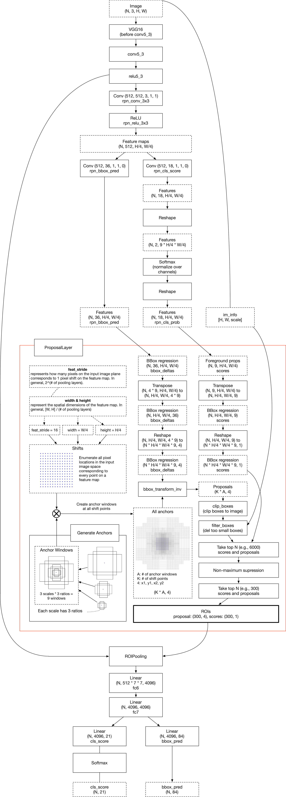

# Faster RCNN完整流程分析

Faster RCNN模型主要分成3个部分：

+ 特征提取部分，提取特征。
+ RPN，产生RoI，计算RPN的分类与定位损失。
+ Head，对RPN产生的RoI进行分类和细调，计算ROI的分类和定位损失。

大致流程如上，但是省略了很多重要的细节。

下面从数据流与接口的角度分析Faster RCNN的完整流程。

**这张图中的降采样率弄错了，应该是16。**

## 一、数据集 (Dataset, DataLoader)

从DataLoader中获取**图片数据**，**边框数据与标签**，**缩放比例**。

> `imgs, bboxes, labels, scale`
>
> 需要scale是因为需要将图片事先缩放到短边、长边在[600, 1000]内。

## 二、Extractor—提取特征

Extractor接受图片，输出提取后的特征。

> `imgs` -> `features`

 这里的Extractor可以VGG、ResNet等网络的特征提取阶段，**注意降采样率为16**。

## 三、Region Proposal Network (RPN)

### 1. 产生预测anchor[==偏移、缩放与分数(前景的概率)==]——用于计算RPN损失

RPN接受**特征提取阶段产生的特征图**，用于**产生**预测的每个位置的**边框的偏移与缩放**、**分数(前景的概率)**。

> `feature` -> `rpn_loc, rpn_score`

`rpn_loc, rpn_score`也需要参与proposal的产生。

### 2. 产生anchor

接下来需要**产生基本的anchor**，参与**anchor_target的生成**，**proposal的生成**。

> 基本的anchor就是特征图中每个像素位置为中心产生的ratios和scales组合的几个bounding box(需要筛选)。

### 

### 3. 生成目标anchor (anchor_target_creator)——用于计算RPN损失

接受 **边框(bboxes), anchor，图片尺寸(`img_size`)**，产生**预测的anchor [偏移与缩放，分数]**。

> `bbox, anchor, img_size` -> `gt_rpn_loc, gt_rpn_cls`

生成目标anchor的时候**需要图片尺寸**，是因为**要筛选出落在图片内部的anchor**。(论文中提到)

### 4. 生成proposals(RoIs) (ProposalCreator)—给Fast RCNN进行分类和微调

接受**预测的`rpn_loc, rpn_score`**，之前**生成的anchor**，**图片尺寸`img_size`**，**缩放比率`scale`**，**生成RoIs** (即proposals)。

> `rpn_loc, rpn_score, anchor, img_size, scale` -> `roi` -> `rois`
>
> 这里这样做是因为batch_size > 1的话，roi需要集中在一起，不过这里只用batch_size = 1。
>
> rois之后还要生成一个`rois_indices`，表示所属图片。

产生proposals需要的超参数和具体过程看前面的分析。

## 四、Fast R-CNN Head——对proposals分类、进一步细调

超参数：

+ `n_class`：包括背景在内的所有类别数量。
+ `roi_size`：经过RoI池化之后的特征图的高度和宽度。
+ `spatial_scale`：RoI被缩放的比率。
+ `classifier`：用于分类的两层全连接层(从vgg16或其他网络结构中导出)。

### 1. 生成目标proposals (ProposalTargetCreator)—用于计算Fast R-CNN损失

超参数：

+ `n_sample`：采样区域的数量。

+ `pos_ratio`：标记为前景的样本比率。

+ `pos_iou_threshold`：认为是前景的RoI的IoU阈值。

+ `neg_iou_threshold_high， neg_iou_threshold_low`：如果IoU在

  `[neg_iou_threshold_low, neg_iou_threshold_high)`，RoI被认为是背景。

过程：

接受 **感兴趣区域(RoI)，边框 (bbox)，标签(label)，定位正则化的均值与方差**，生成**采样的RoI(索引)，以及对应的偏移与缩放(所有类别)，标签**`gt_roi_loc，gt_roi_label`。

> `roi, bbox, label, loc_roi_mean, loc_roi_std`  -> `sample_roi, gt_roi_loc, gt_roi_label`.

具体的过程看前面的分析文件。

### 2. 产生预测的ROI偏移、缩放、分类的分数

接受 特征图，采样的roi，和roi索引，产生roi的对各个分类的偏移与缩放、分数，`roi_cls_loc, roi_score`。

> `feature_map, sampled_roi, sampled_roi_indices` -> `roi_cls_loc, roi_score`

生成的`roi_cls_loc， roi_score`用于计算Fast R-CNN阶段的损失。

