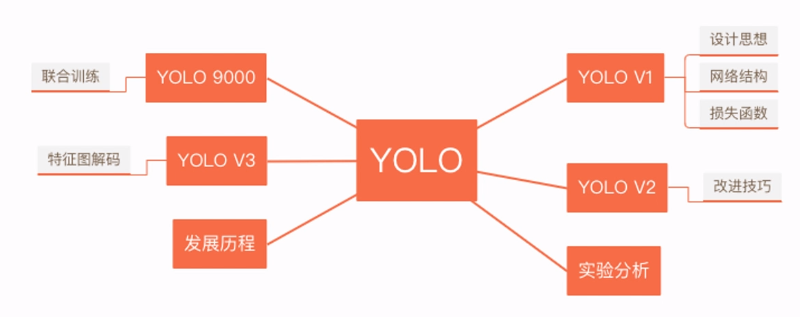

# YOLO系列算法简介

YOLO系列的主要版本，当然还有2020年提出的YOLO v4。

YOLO的历史意义：

+ **创造性地将识别与定位合二为一。**
+ 由于其检测速度极快，在实际应用中十分受欢迎。

## 一、YOLO v1

YOLO的原理：

+ 一次性输出所检测到的目标的信息，包括类别和位置。
+ **只要求这个物体的中心在某个grid内。**这意味着我们不需要设计非常大的框。

