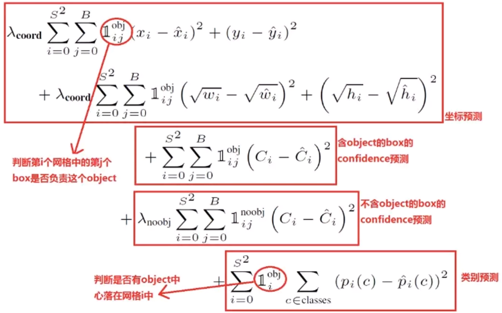

# 损失函数的实现

### 一、YOLO v1的损失函数的实现




是否含有目标可以通过置信度是否为0判断，此外，有一些通用的实现损失函数的技巧：

+ $I_{ij}^{obj},I_{ij}^{noobj},I_{i}^{obj}$可以**通过tensor的位掩码筛选出来**;

+ **多个求和符号，在实现的时候除了最后一维不变，将其展开为2维的**。

+ **差的平方**，即L2 Loss，可以**调用mse_loss**实现。

  

在Pytorch中，自定义的损失函数也是计算图的一部分，即定义成一个网络层：

```python
class Loss(nn.Module):
    # S, B, coord, noobj为损失函数的超参数
    def __init__(self, S, B, coord, noobj):
        self.S = S
        self.B = B
        self.coord = coord
        self.noobj = noobj
        super(Loss, self).__init__()
    
    def xywh2xyxy(x: torch.Tensor):
        y = torch.zeros_like(x)
        y[:, 0] = x[:, 0] - x[:, 2] / 2
        y[:, 2] = x[:, 0] + x[:, 2] / 2
        y[:, 1] = x[:, 1] - x[:, 3] / 2
        y[:, 3] = x[:, 1] + x[:, 3] / 2
        return y
    
    def xywh2xyxy_np(x):
        y = np.zeros_like(x)
        y[:, 0] = x[:, 0] - x[:, 2] / 2
        y[:, 2] = x[:, 0] + x[:, 2] / 2
        y[:, 1] = x[:, 1] - x[:, 3] / 2
        y[:, 3] = x[:, 1] + x[:, 3] / 2
        return y
    
    # 计算IOU
    def bbox_iou(self, box1, box2, xywh=True):
        if xywh:
            b1_x1, b1_x2 = box1[:, 0] - box1[:, 2] / 2, box1[:, 0] + box1[:, 2] / 2
            b1_y1, b1_y2 = box1[:, 1] - box1[:, 3] / 2, box1[:, 1] + box1[:, 3] / 2
            b2_x1, b2_x2 = box2[:, 0] - box2[:, 2] / 2, box2[:, 0] + box2[:, 2] / 2
            b2_y1, b2_y2 = box2[:, 1] - box2[:, 3] / 2, box2[:, 1] + box2[:, 3] / 2
        else:
            b1_x1, b1_y1, b1_x2, b1_y2 = box1[:, 0], box1[:, 1], box1[:, 2], box1[:, 3]
            b2_x1, b2_y1, b2_x2, b2_y2 = box2[:, 0], box2[:, 1], box2[:, 2], box2[:, 3]
        
        intersect_x1 = torch.max(b1_x1, b2_x1)
        intersect_y1 = torch.max(b1_y1, b2_y1)
        intersect_x2 = torch.min(b1_x2, b2_x2)
        intersect_y2 = torch.min(b1_y2, b2_y2)

        intersection_area = torch.clamp(intersect_x2 - intersect_x1 + 1, min=0) * torch.clamp(intersect_y2 - intersect_y1 + 1, min=0)

        b1_area = (b1_x2 - b1_x1 + 1) * (b1_y2 - b1_y1 + 1) 
        b2_area = (b2_x2 - b2_x1 + 1) * (b2_y2 - b2_y1 + 1)

        iou = intersection_area / (b1_area + b2_area - intersection_area + 1e-16)
        return iou

    def forward(self, predict: torch.Tensor, target: torch.Tensor):
        """
        @param: predict ->  tensor (N, S, S, 5 x B + 20=30) , the format of bounding box prediction [x, y, w, h, c]
        @param: target -> tensor (N, S, S, 5 x B + 20=30) 
        """
        N = predict.shape[0]
        # 获得每个方格是否有目标的位掩码
        has_object_mask = target[:, :, :, 4] > 0
        no_object_mask = target[:, :, :, 4] == 0
        has_object_mask = has_object_mask.unsqueeze(-1).expand_as(target)
        no_object_mask = no_object_mask.unsqueeze(-1).expand_as(target)

        has_object_predict = predict[has_object_mask].view(-1, 30)
        box_predict = has_object_predict[:, :10].contiguous().view(-1, 5)
        class_predict = has_object_predict[:, 10:]

        has_object_target = target[has_object_mask].view(-1, 30)
        box_target = has_object_target[:, :10].contiguous().view(-1, 5)
        class_target = has_object_target[:, 10:]

        # 分类损失
        class_loss = F.mse_loss(class_predict, class_target, size_average=False)

        # 计算不包含目标的方格置信度损失
        no_object_predict = predict[no_object_mask].view(-1, 30)
        no_object_target = target[no_object_mask].view(-1, 30)
        no_object_predict_mask = torch.ByteTensor(no_object_predict.shape)
        no_object_predict_mask.zero_()
        no_object_predict_mask[:, 4] = 1
        no_object_predict_mask[:, 9] = 1
        no_object_predict_c = no_object_predict[no_object_predict_mask]
        no_object_target_c = no_object_target[no_object_predict_mask]
        no_object_confidence_loss = F.mse_loss(no_object_predict_c, no_object_target_c, size_average=False)

        coo_response_mask = torch.ByteTensor(box_target.shape)
        coo_response_mask.zero_()
        coo_not_response_mask = torch.ByteTensor(box_target.shape)
        coo_not_response_mask.zero_()
        # 存在目标的方格的置信度为IOU
        box_target_iou = torch.zeros_like(box_target)
        for i in range(0, box_target.shape[0], 2):
            box1 = box_predict[i:i + 2]
            box2 = box_target[i:i + 2]
            iou = self.bbox_iou(box1, box2, xywh=True)
            max_iou, max_index = iou.max(dim=0)
            coo_response_mask[i + max_index] = 1
            coo_not_response_mask[i + 1 - max_index] = 1
            box_target_iou[i + max_index] = max_iou.data

        box_predict_response = box_predict[coo_response_mask].view(-1, 5)
        box_target_response_iou = box_target_iou[coo_response_mask].view(-1, 5)
        box_target_response = box_target[coo_response_mask].view(-1, 5)
        contain_loss = F.mse_loss(box_predict_response[:, 4], box_target_response_iou[:, 4], size_average=False)
        location_loss = F.mse_loss(box_predict_response[:, :2], box_target_response[:, :2], size_average=False) +\
                        F.mse_loss(torch.sqrt(box_predict_response[:, 2:4], torch.sqrt(box_target_response[:, 2:4])), size_average=False)

        return (self.coord * location_loss + contain_loss + self.noobj * no_object_confidence_loss + class_loss) / N

```

