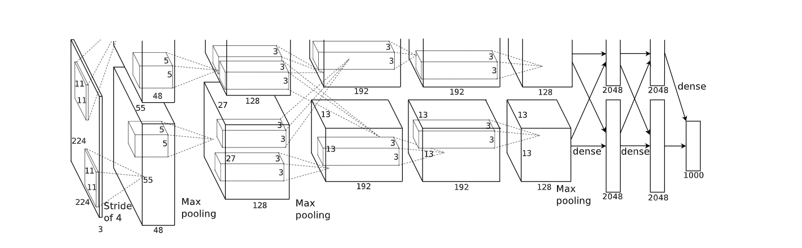

## 一、Abstract

The contributions of this paper:

1. Propose a neural network, consists of five convolution layers, some of which are followed by max-pooling layers, and three full-connected layers with a final 1000-way softmax.
2. Use non-saturating neurons and an efficient GPU implementation of the convolution operation.
3. Employ regularization method "dropout" and achieve good performance.

## 二、Inroduction

机器学习方法在现在的目标识别方法中起着重要作用。我们可以通过收集更大的数据集，学习更加强大的模型来提高它们的表现，也可以使用更好的技术来预防过拟合。

> Current approaches to object recognition make essential use of machine learning methods.  To improve their performance, we can collect larger datasets, learn more powerful models, and use better techniques for preventing overfitting.

为了从上百万张图片中学习上千中目标，我们需要一个具有更强大学习能力的模型。

但是这次目标识别任务的巨大的复杂性，意味着新的模型需要有许多先验知识，来弥补我们没有的所有数据，CNN就是其中之一。

## 三、The Dataset

这篇论文的模型训练集1.2 million，验证集50 thousand，测试集150 thousand。

图像识别常用的两个错误率(error rate): top-1, top-5。

> **评价模型预测错误率的两个指标** Top-1 error, Top-5 error.
>
> the top-5 error rate is the fraction of test images for which the correct label is not among the five labels considered most probable by the mode

训练输入图片都是$256\times256$的，所以会对图片进行降采样，长方形的会将短边缩放到256，之后裁剪出中间$256\times 256$的部分。

## 四、网络架构

网络包括8层学习层：5层卷积，3层全连接。下面是一些网络架构的特点：

### 1. ReLU (修正线性单元)

使用ReLU (Rectified Linear Unit)作为激活函数，因为ReLU是非饱和的激活函数，所以可以获得比tanh和sigmod更快的收敛速度。

### 2.在多GPU上训练

在两个GPU上并行训练，在每个GPU上防止一半的核心(神经元)，并且使用了一个技巧：GPU仅在特定层进行通信。

> This means that, for example, the kernels of layer 3 take input from all kernel maps in layer 2. However, kernels in layer 4 take input only from those kernel maps in layer 3 which reside on the same GPU. 

### 3. Local Response Normalization(LRN，局部响应值归一化)

现在LRN已经被Dropout，BN等代替了。

### 4. Overlapping Pooling

> Pooling layers in CNNs summarize the outputs of neighboring groups of neurons in the same kernel map.  Traditionally, the neighborhoods summarized by adjacent pooling units do not overlap。
>
> To be more precise, a pooling layer can be thought of as consisting of a grid of pooling units spaced s pixels apart, each summarizing a neighborhood of size z×z centered at the location of the pooling unit. 
>
> **If we sets < z, we obtain overlapping pooling.**

经过实验发现使用overlapping pooling的模型不容易过拟合。

### 5. Overall Architecture

1. 8层带权值的学习层：前5层卷积层，后3层全连接层。

2. 最后一层全连接层的输出被送入1000路softmax，生成对于1000个类型标签的分布。

   > Our network maximizes the multinomial logistic regression objective, which is equivalent to maximizing the average across training cases of the log-probability of the correct label under the prediction distribution.

3. 第2,4,5层卷积层仅和前一层卷积层中在同一个GPU上的kernel map连接。

4. 第3层卷积层和第2层卷积层中所有的kernel map连接。

5. 全连接层中所有神经元和前一层所有神经元连接。

6. Response-normalization 层在第一层和第二层卷积层之后。

7. Max-pooling 层在Response-normalization层和第5层卷积层之后。

8. ReLU被用在所有卷积层和全连接层的输出。

网络结构：

> 1. The first convolutional layer filters the 224×224×3 input image with 96 kernels of size11×11×3 with  a  stride  of  4  pixels  (this  is  the  distance  between  the  receptive  field  centers  of  neighboring neurons in a kernel map).  
> 2. The second convolutional layer takes as input the (response-normalized and pooled) output of the first convolutional layer and filters it with 256 kernels of size 5×5×48. The third, fourth, and fifth convolutional layers are connected to one another without any intervening pooling  or  normalization  layers.   
> 3. The  third  convolutional  layer  has  384  kernels  of  size 3×3×256 connected to the (normalized, pooled) outputs of the second convolutional layer.  
> 4. The fourth convolutional layer has 384 kernels of size 3 ×3×192.
> 5. The fifth convolutional layer has 256 kernels of size 3×3×192. 
> 6. The fully-connected layers have 4096 neurons each.

## 五、Reducing Overfitting

AlexNet使用了两种方法减小过拟合：

1. 数据增强(Data Augmentation).
2. 随机失活(Dropout).

### 1. Data Augmentation

> The easiest and most common method to reduce overfitting on image data is to artificially enlarge the dataset using label-preserving transformation.

数据增强就是对原图片进行少量计算，生成很多新的图片，而这些新的图片不需要存储在硬盘上，因此，我们可以使用少量的数据集生成充足的数据来训练。

> In our implementation, the transformed images are generated in Python code on the CPU while the GPU is training on the previous batch of images. So these data augmentation schemes are, in effect,computationally free.

#### (1) generating image translations and horizontal reflections

对图片进行移位和水平翻转，生成大量图片用于训练。

> We do this by extracting random 224×224 patches (and their horizontal reflections) from the 256×256 images and training our network on these extracted patches.
>
> **截取操作可以实现移位的效果。**
>
> At test time, the network makes a prediction by extracting five 224×224 patches (the four corner patches and the center patch) as well as their horizontal reflections (hence ten patches in all), and averaging the predictions made by the network’s softmax layer on the ten patches.
>
> 测试时，网络根据四个角落和中心的224 × 224的patch以及其水平翻转，总计10个patch，进行预测，将十个由softmax层获得的预测结果进行平均。

#### (2) altering the intensities of the RGB channels

改变训练图片的RGB通道的强度。

> Specifically,  we  perform  PCA  on  the  set  of  RGB  pixel  values  throughout  the ImageNet training set.
>
> To each training image, we add multiples of the found principal components, with magnitudes proportional to the corresponding eigenvalues times a random variable drawn from a Gaussian with mean zero and standard deviation 0.1.
>
> 对ImageNet训练集的RGB像素值集合执行PCA。之后对每个训练数据，加上找到的主成分的倍数，以及大小与对应的**特征值乘上均值为0,标准差为0.1的高斯分布的随机值**成比例的值。
>
>  Therefore to each RGB image pixel $I_{xy}=[I^R_{xy},I^G_{xy},I^B_{xy}]^T$ we add the following quantity:
> $$
> [p_1,p_2,p_3][\alpha_1\lambda_1,\alpha_2\lambda_2,\alpha_2\lambda_3]^T
> $$
> 这里$p_i,\lambda_i$是$3\times3$RGB像素值的协方差矩阵的第$i\mathrm{th}$特征向量和特征值，$\alpha_i$是随机变量。
>
> this scheme approximately captures an important property of natural images,namely, that object identity is invariant to changes in the intensity and color of the illumination
>
> 这个方案可以获取图片的重要属性，因为物体的身份是不会随着光照的强度和色彩而发生变化。

> 这个好像用的较少。。。

### 2. Dropout

AlexNet中Dropout用于前两个全连接层，使用Dropout的话，达到收敛需要迭代的次数是成倍(反比)增加的。

> The recently-introduced technique, called “dropout” , consists of setting to zero the output of each hidden neuron with probability 0.5.  The neurons which are“dropped out” in this way do not contribute to the forward pass and do not participate in back-propagation. 
>
> 这样，每次获取一个输入，神经网络会使用不同的结构，但是这些结构共享权重。
>
> 因为一个神经元不会依赖与特定的神经元，所以dropout可以减少复杂的神经元”协同调整“。
>
> 这样可以学习更多健壮的特征，这些特征在和其他随机神经元的子集协同使用时有用。
>
> 
>
>  At test time, we use all the neurons but multiply their outputs by 0.5, which is a reasonable approximation to taking the geometric mean of the predictive distributions produced by the exponentially-many dropout networks.
>
> 测试时只需要对输出乘以随机失活的概率就行。

## 六、Details of learning

权值$\omega$的更新过程：
$$
v_{i+1}:=0.9\cdot v_i-0.0005\cdot \epsilon\cdot w_i-\epsilon \cdot <\frac{\part L}{\part \omega}|_{w_i}>_{D_i}\\
w_{i+1}:=w_i+v_{i+1}
$$
这里$i$是迭代轮数下标，$v$是动量变量，$\epsilon$是学习率，$<\frac{\part L}{\part \omega}|_{w_i}>_{D_i}$是batch $D_i$中对$w$在$w_i$处偏导的均值。

> batch大小为128, momentum 为 0.9, 权值衰减(weight decay)为0.0005。

每层的权值初始化采用随机初始化法，服从$N(0,0.01)$，第2, 4, 5卷积层以及全连接层加入常数偏置1，其余层初始化的偏执为0。

所有层的学习率都一样，只是在学习过程中手动调整。

> augment 增强
>
> non-saturating 非饱和
>
> immense 巨大的
>
> specify 具体指定
>
> prior knowledge 先验知识
>
> crop out 裁剪出
>
> denote 表示
>
> overlap 重叠
>
> multinomial 多项式的
>
> receptive field 感受野
>
> patch 块、补丁
>
> magnitude 大小
>
> eigenvalue 特征值
>
> principal components 主成分
>
> deviation 偏差
>
> standard deviation 标准差
>
> invariant 不变的
>
> illumination 光照
>
> converge 收敛
>
> momentum 动量
>
> qualitatively 定性地
>
> probe 探究
>
> induce 