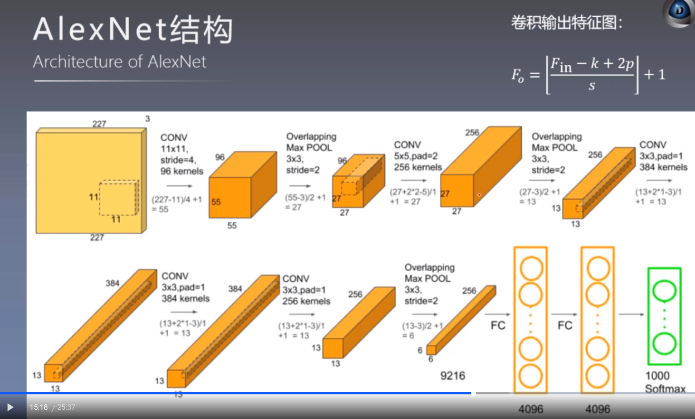

# AlexNet的实际网络结构与参数数量计算

## 一、AlexNet的实际网络结构

论文中给出的信息不够详细，而且一开始的图片应当是$227\times227\times3$的。

## 二、参数数量计算

| Layer Name  | Padding | Kernel       | Stride | filter | img size                 | tensor size           | weights                         | bias | parameters |
| ----------- | ------- | ------------ | ------ | ------ | ------------------------ | --------------------- | ------------------------------- | ---- | ---------- |
| Input image |         |              |        |        |                          | $227\times227\times3$ | 0                               | 0    | 0          |
| Conv1       | 0       | $11\times11$ | 4      | 96     | $(227-11)/4+1=55$        | $55\times55\times96$  | $3\times(11\times11)\times96$   | 96   | 34944      |
| Maxpool1    | 0       | $3\times3$   | 2      | 96     | $(55-3)/2+1=27$          | $27\times27\times96$  | 0                               | 0    | 0          |
| Conv2       | 2       | $5\times5$   | 1      | 256    | $(27-5+2\times2)/1+1=27$ | $27\times27\times256$ | $96\times(5\times5)\times256$   | 256  | 614656     |
| Maxpool2    | 0       | $3\times3$   | 2      | 256    | $(27-3)/2+1=13$          | $13\times13\times256$ | 0                               | 0    | 0          |
| Conv3       | 1       | $3\times3$   | 1      | 384    | $(13-3+2\times1)/1+1=13$ | $13\times13\times384$ | $256\times(3\times3)\times384$  | 384  | 885120     |
| Conv4       | 1       | $3\times3$   | 1      | 384    | $(13-3+2\times1)/1+1=13$ | $13\times13\times384$ | $384\times(3\times3)\times384$  | 384  | 1327488    |
| Conv5       | 1       | $3\times3$   | 1      | 256    | $(13-3+2\times1)/1+1=13$ | $13\times13\times256$ | $384\times(3\times3)\times256$  | 256  | 884992     |
| Maxpool3    | 0       | $3\times3$   | 2      | 256    | $(13-3)/2+1=6$           | $6\times6\times256$   | 0                               | 0    | 0          |
| FC1         |         |              |        |        |                          | $4096\times1$         | $(6\times6\times256)\times4096$ | 4096 | 37752832   |
| FC2         |         |              |        |        |                          | $4096\times1$         | $4096\times4096$                | 4096 | 16781312   |
| FC3         |         |              |        |        |                          | $1000\times1$         | $4096\times1000$                | 1000 | 4097000    |
| Output      |         |              |        |        |                          | $1000\times1$         | 0                               | 0    | 0          |
| Total       |         |              |        |        |                          |                       |                                 |      | 62378344   |

卷积层参数数量的计算：
$$
F_{in}\times(kernel\_size\times kernel\_size)\times F_{out}+Bias(i.e.\;F_{out})
$$
卷积层中，连接的数量有$F_{in}\times(kernel\_size\times kernel\_size)\times F_{out}$个，偏置参数的数量和输出通道数(output feature map number)一样。

全连接层参数数量计算：
$$
F_{in}\times F_{out}+F_{out}
$$
全连接层所有元素直接相连，加上偏置。

经此计算可以得到网络的参数数量。

> 池化层不用计算参数数量。

