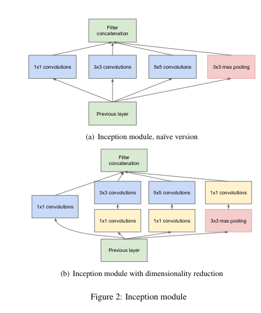

# Going Deeper with Convolutions

## 一、Abstract

我们提出了一个深度卷积神经网络结构叫做Inception，该结构获得了在图像分类和目标检测领域的最好表现。

该结构的主要标志是对网络中计算资源利用的提高。通过仔细设计，我们增加了网络的深度和宽度，同时保持了计算费用不变。为了优化质量，该结构的决策基于Hebbian原则和多尺度处理的直觉。

## 二、Introduction

现在计算机视觉的目标分类和检测的进步主要靠的是新思想、算法和网络结构。

我们在ILSVRC 2014上提交的GoogleNet的参数量是AlexNet的$1/12$，而且准确率更高。

关于目标检测，最大的收获不是简单地来自越来越大越深的网络，而是深度结构和经典计算机视觉的协同合作，例如R-CNN。

另一个需要注意的因素：随着移动和嵌入式计算的普及，算法的效率，尤其是功耗和使用的内存，越来越重要。这也是GoogleNet考虑的一大因素。

在大多数实验中，模型被设计成在推理时保留计算代价在1.5 billion multiply-adda，这样不止在学术领域，这模型也可以被用到现实世界，即使在更大的数据集上，也可以有合理的代价。

这篇论文主要讲用于计算机视觉的深度神经网络架构Inception，该名字从Network in Network(NIN)和“we need to go deeper”两篇论文中获得。这里的“deep”有的含义：

+ 我们通过Inception模块的形式引入架构中新的网络层，直接意义上就是增加的网络深度。

+ > 这个我也不知道怎么翻译。。。

## 三、Related Work

从LeNet-5开始CNN成为有一个标准的结构：堆叠的卷积层(后面可以选择加正则化或者最大池化层)，之后跟着一个或多个全连接层。这些基础设计的变种在图像分类领域很流行并且产生了到目前为止在MINST，CIFAR，IMageNet上的最好表现。最近的趋势是增加网络层数和宽度，同时使用dropout去处理过拟合的问题。

尽管最大池化曾会导致准确的空间信息的丢失，和AlexNet具有相似结构的卷积网络成功应用到目标定位、检测，人脸识别等领域。

受到视觉皮层(visual cortex)的神经元模型启发，Serre使用了一系列修改过的不同大小的Gabor filters来处理不同的尺度。我们使用了相似的策略。但是，Inception中的所有filter都是可学习的。此外，Inception层会重复很多次，其结果就是22层深的GoogLeNet模型。

Network-in-Network 是由 Lin提出的用来解决神经网络表示能力的一个方法，在他们的模型中，网络中增加了额外的$1\times1$的卷积层，增加了其深度。我们的架构中也深度使用了这个方法。但是，在我们的设置中，$1\times1$的卷基层有对偶目的：最重要的是，它们主要被用做维度归约模块(dimension reduction module)，用移除会限制网络大小的计算瓶颈。这允许我们能够继续增加网络深度和宽度而没有很大的性能损失。

最后，现在目标检测领域最好的算法是R-CNN。R-CNN将整体的目标检测问题分解成两个子问题：

+ 使用低级线索，比如色彩、纹理，以与类别无关的方式来产生目标位置候选区域。
+ 然后使用CNN分类器来标识那些位置的目标的类别。

这种两阶段的方法使用了带有低级线索bounding box的准确率，和CNN的高级分类能力。

在我们的目标检测提交中，使用了类似的pipeline，但是在两个阶段都进行提升，比如multi-box prediction for higher object bounding box recall and  ensemble  approaches  for  better categorization of bounding box proposals。

## 四、Motivation and High Level Considerations

最直接的提高深度神经网络的方法是增加其大小：

+ 增加网络深度。
+ 增加网络宽度，每层的神经元个数。

这是训练高质量模型的一个简单且安全的方法，尤其是给定许多标记好的训练数据的容量的时候，但是，这种简单的解决方法会带来两个问题。

+ 更大的网络大小意味着更多的参数，这使得扩大的网络更容易过拟合，尤其是训练数据集中的标记数据数量有限。这是标记数据集在花费巨大代价之后获得的主要瓶颈，这通常需要专业的人评分，来区分许多细粒度的视觉类别。
+ 增加网络大小的另一个缺点是会急剧增大对计算资源的使用。举个例子，在深度视觉网络中，如果两个卷积层连接，任何在卷积核数量上的统一增加会导致计算量的平方增加。如果增加的容量没有充分利用，例如多数权重最终接近于0,那么许多计算量被浪费了。因为计算资源总是有限的，一个高效的计算资源分布比随意的增加网络大小更好，即使当主要目标是提高表现的质量。

用于解决这两个问题的基础方法是引入稀疏性并使用稀疏的网络层代替全连接层，即使是在卷积层中。除了模仿生物系统，这也应当有来自Arora的突破性工作作为坚实的理论基础的好处。他们的主要结果表明如果数据集的概率分布能够被一个庞大的且稀疏的深的神经网络表示，那么最优的网络拓扑结构可以通过分析前面网络的激活函数和聚集和输出高度相关的神经元来一层一层地构造。尽管严格的数学证明需要非常强的条件，但是事实上这个理论和Hebbian准则协调得很好：连接在一起的神经元表明隐藏的idea是可应用的，即使在不那么严格的条件下。

不幸的是，当涉及到在非标准化的稀疏数据结构的数值计算，现在的计算设备还是不那么高效的。

即使代数运算操作减少了100倍，但是查找和缓存未命中的开销会占据主要地位，因此切换到稀疏矩阵不是那么合算的。这个差距会通过使用对密集矩阵计算进行高度优化的数值计算库而增大。并且，非标准化的稀疏矩阵仅仅是通过使用卷积来使用空间上的稀疏性。但是，卷积被实现为与较早层中补丁的密集连接的集合。

从AlexNet开始，卷积网络就在特征维度上传统地使用了随机和稀疏连接表，用于打破对称性并改善学习效果，然而趋势是变回全连接网络，为了更好的优化并行计算。

现在计算机视觉的最好的架构有标准化结构。越来越多的卷积核数量和更大的batch size使得密集计算得到充分利用。

这引起了关于是否有下一步、中间的步骤的问题：一个使用filter-level稀疏性的架构，正如理论表示的，是通过使用在稠密矩阵上的计算来表现我们当前的硬件。大量的稀疏矩阵计算表明了将稀疏矩阵聚集到相对稠密的子矩阵，用来给稀疏矩阵乘法提供可竞争的表现。看起来，在不久的将来会采用类似的方法来自动构建统一的深度学习架构。

Inception架构最初是作为一个案例来评估一个复杂的网络拓扑构造算法的假设输出，该算法试图逼近视觉网络的稀疏结构，并通过密集的，易于获得的组建来覆盖假设的结果。

尽管这一开始是猜测的，但是和基于NIN的引用网络相比，在一开始还是获得了不错的提升。

经过一些调整，差距进一步扩大。Inception在定位和目标检测的背景下被证明特别有用。

有趣的是，尽管大多数原始的架构受到质疑，并在分类中进行彻底的测试，事实证明他们与局部最佳选择非常接近。

我们需要注意：尽管Inception结构在计算机视觉是成功的，但是还是有关于是够可以将这加入到指导准则上的疑问。确保这会需要更多的整体分析和证明。

## 五、Architectural Details

Inception架构的主要思想是考虑如何才能近似估计卷积视觉网络的最佳局部稀疏结构，并通过可用的稠密组件覆盖。注意，假设平移不变意味着我们的网络将由卷积构建模块构建。我们要做的是找到最优的局部结构然后空间上重复它。

Arora建议一层层构建，其中我们应当分析最后一层的相关数据，并将它们聚集成具有高度相关性的单元组。这些聚簇形成了下一层的单元，并且和前一层的单元相连接。我们假设每个来自前面层的每个单元和输入图像的一些区域对应，并且这些单元被分组为滤波器组。在较低的层(靠近输入的层)中，相关单元会集中在局部区域。因此，我们最终会有需要集中在单个区域的聚簇，并且它们可以被下一层$1\times1$的卷积层覆盖。

然而，我们可以预料到，在较大patch上的卷积可以覆盖较少数量的在空间上扩展的聚类，并且在越来越大的区域上patches的数量会减少。

> patch就是与卷积核大小相同的输入上的块。

为了避免patch对齐问题，现在Inception架构的化身被限制在卷积核大小为$1\times1,3\times3,5\times5$。这个据定更多的是为了方便而不是必要。这也意味着建议的架构是这些网络层的组合，它们的输入卷积核组被连接到单个输出矢量中，形成下一级的输入。此外，因为池化操作对现在的卷积网络的成功非常重要，这表明在每个这样的阶段后添加一个可选的平行的池化路径应该会有额外的好处。

因为这些Inception modules互相堆叠，它们输出相关统计数据一定会发生变化：因为更高抽象的特征被更高网络层获取，它们的空间集中度可以预料到降低。这表明$3\times3,5\times5$的卷积的比率应当随着我们移到更高层而增加。

上面这些模块的一个大问题，至少在这种简单的形式下，在具有大量卷积核的卷积层上即使是少量的$5\times5$卷积也会造成过高的代价。一旦池化单元被加入，这个问题会变的更加明显，因为输出卷积核的数量等于上一阶段的输出卷积核数量。池化层和卷积层输出的合并会不可避免地导致每个阶段输出数量的增加。尽管这个架构可能覆盖了最优的稀疏结构，但是实现不友好，会导致在少数阶段中计算量的激增。

这引出了关于Inception架构的第二个想法：明智地减少维度，以防计算需求增加过多。这是基于embedding的成功：即使是低维的embedding也可能有大量关于相当大的图像patch的信息。但是embedding以稠密、压缩的形式表示信息，而压缩的信息是很难处理的。该信息表示在多数情况下保持稀疏，并且仅在需要将其汇总时才压缩信号。即$1\times1$的卷积应当在高代价的$3\times3,5\times5$卷积前被计算归约。除了用作归约，它们也包括使用修正线性单元来使它们具有双重用途。

总的来说，一个Inception网络是由互相堆叠的模块组成的网络，带有偶然的步长为2的最大池化层来使网格的分辨率减半。因为技术原因(训练时的内存效率)，仅仅在高层使用Inception module，保持底层使用传统的卷积方式似乎是有好处的。这不是严格必要的，仅仅反映了我们现在的实现的一些基础设施的效率。

这个架构的一个有效的方面是它允许在每个阶段大量增加单元的数量而不用控制在后面阶段激增的计算复杂度。这通过在昂贵的卷积和较大的patch尺寸钱普遍使用降维来实现的。此外，这个设计遵循了实践指导，视觉信息应当在多个尺寸被处理，然后汇总，以便于下一阶段能够从不同的尺度同时提取特征。

对计算资源使用的提高允许增加每个阶段的宽度和阶段的个数，而不用太多的计算复杂度。我们可以利用Inception架构创建稍微差一点的，但是在计算上更便宜的版本。我们发现所有可用的旋钮和杠杆都可以实现计算资源的受控平衡，从而使网络能够比Inception架构的网络快3到10倍，但是这需要仔细的手动设计。

## 六、GoogLeNet

在ILSVRC 2014比赛上提交的是GoogleNet，一个Inception架构的实现，当时虽然有一个更深更宽的Inception网络，但是提升有限，所以没用。

所有的卷积层，包括那些在Inception模块中的，都使用修正线性单元。我们网络的感受野的大小是$224\times224$，在RGB图像上，均值为0。

>  “#3×3 reduce” and “#5×5 reduce”stands for the number of 1×1 filters in the reduction layer used before the 3×3 and 5×5 convolutions.  One can see the number of 1×1 filters in the projection layer after the built-in max-pooling in the pool proj column.  All these re-duction/projection  layers  use  rectified  linear  activation  as well.

该网络的设计考虑到了计算效率和实用性，因此推理可以在单个设备上运行，甚至包括那些计算资源有限的设备，特别是内存占用较低的。

该网络一共22层，如果只计算带参数的网络层，带上池化层的话有27层。用于构造网络的总的网络层数量，包括独立的构造块，大概有100层。具体的数字取决于机器的学习设施如何统计。

在分类器之前使用平均池化是基于VGG的，尽管我们的实现有额外的线性层，这个线性层允许我们轻松地调整我们的网络到其他标记数据集上，的那是这主要是为了方便，我们并不认为这会有主要作用。我们发现从全连接层移到平均池化层提高了top-1的准确率0.6%，但是dropout的使用仍然是非常重要的，即使移除了全连接层。

给定相对较深的网络，网络用一种高效的方式反向传播所有网络层计算梯度是我们关心的。稍浅的网络在这任务上的强大表现表明由网络中间的层产生的特征是非常具有标识度的。通过增加家辅助分类器和这些中间层相连，预计在分类器的低阶段会进行区分。这被认为能够解决梯度消失问题并同时提供正则化。这些采用小卷积网络的分类器放在Inception模块输出的上面。

在训练时，它们的损失会经过权重衰减之后加到网络的总损失中，辅助分类器的损失的权重是0.3。

在推理时，这些辅助分类器被丢弃。之后控制实验表示辅助分类器的效果非常小，我们只需要其中一个就可以获得相同的效果。

额外的网络(包括辅助分类器)的确切结构如下:

+ An  average  pooling  layer  with 5×5 filter  size  and stride 3, resulting in an 4×4×512 output for the (4a),and 4×4×528 for the (4d) stage.
+ A1×1convolution with 128 filters for dimension reduction and rectified linear activation. 
+ A fully connected layer with 1024 units and rectifiedlinear activation.
+ A dropout layer with 70% ratio of dropped outputs.
+ A linear layer with softmax loss as the classifier (pre-dicting the same 1000 classes as the main classifier, but removed at inference time)

## 七、Training Methodology

GoogLeNet 网络使用DistBelief 分布式机器学习系统训练，使用适量的模型和数据并行性。尽管只使用了基于CPU的实现，但是粗略估计表明GoogLeNet 网络可以使用一些高性能GPU在一周内训练到拟合。我们的训练使用了异步SGD，动量为0.9,修改过的学习率计划是每过8个epoch降低4%。在推理时使用Polyak平均来创造最终的模型。

图像采样方法在比赛的几个月里发生了重大变化，并且已经有使用这些选项拟合的模型，有时结合了变化的超参数，比如dropout和学习率。因此很难给出确定性的的指导给多数高效的单一方法来训练这些网络。

To complicate matters further, some of the models were mainly trained on smaller relative crops,others on larger ones.

 Still, one prescription that was verified to work very well after the competition, includes sampling of various sized patches of the image whose size is distributed evenly between 8% and 100% of the image area with aspect ratio constrained to the interval. 

## 八、ILSVRC 2014 Classification Challenge Setup and Results

采用的一些技术:

1. 独立训练7个相同的GoogleNet模型，其初始化、学习率调整策略都一样，不同是采样方法和随机输入图片顺序。

2. 在测试时采用了比AlexNet更激进的裁剪方法。主要是将图片缩放到4个不同的尺寸，短边为256,288,320,352，然后取这些缩放的图片的左、中、右方块。 (in the case of portraitimages, we take the top, center and bottom squares)。对每个方块，FiveCrop，每个224 × 224，加上一个裁剪的块缩放到$224\times224$，还有镜像版本。因此一张图片会产生$4\times3\times6\times2=144$个裁剪块。

   We note that such aggressive cropping may not be necessary in real applications, as the benefit of more crops becomes marginal after a reasonable number of cropsare present.

3. Softmax概率在多个块和所有的单个分类器上取平均，获得最终的预测结果。

   经过验证数据发现简单的取平均效果最好。

## 九、ILSVRC 2014 Detection Challenge Setup and Results

The  ILSVRC  detection  task  is  to  produce  bounding boxes around objects in images among 200 possible classes.

+ Detected  objects  count  as  correct  if  they  match  the  classof the groundtruth and their bounding boxes overlap by atleast 50% (using the Jaccard index)
+ Results are reported using the mean average precision (mAP). 
+ Additionally, the region proposal step is improved by combining  the  selective  search    approach  with  multi-box predictions for higher object bounding box recall.

## 十、Conclusion

随时可用的稠密构建块是来逼近预期的最佳稀疏结构，是改善计算机视觉神经网络的可行方法。与较浅和较窄的架构相比，该方法的主要优点是在适度增加计算需求的情况下可以显著提高质量。

我们的目标检测工作也是具有竞争力的，尽管没有使用上下文信息，也没有进行bounding box回归，表明Inception架构的有点还有更多的证据。

在图像分类和检测领域，可以遇见相似质量的结果可以被许多高代价的非Incpetion类型具有相似深度和宽度的网络获得。但是我们的方法产生了坚实的证据：从整体上来说，转移到稀疏架构是可行的可用的想法。这表明未来的工作是以自动方式来创建稀疏和精细的结构，以及将Inception架构的观点应用到其他领域。

> hallmark：标志，标记
>
> intutition：直觉
>
> synergy：协同作用
>
> on the  ... font：关于
>
> traction：拖
>
> culmination：高潮
>
> prevalent：流行
>
> variant：变种
>
> prone：易于，倾向于
>
> fine-grained ：细颗粒的
>
> quadratic：二次方的
>
> indiscriminate：随意的，肆意的
>
> sparsity：稀疏性
>
> mimick：模仿
>
> groundbreaking：突破性的
>
> underpinning：坚实的基础
>
> symertry：对称性
>
> speculate：推测的，猜测的
>
> incarnation：化身
>
> bank：银行 +组
>
>  modest：少量
>
> pronunced：明显的
>
> judiciously：明智地
>
> aggregate：汇总
>
> masse：大众
>
> en：在
>
> ubiquitous：无处不在的
>
> inference：推理
>
> was excepted：预计

