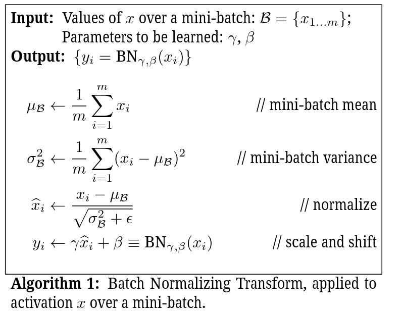
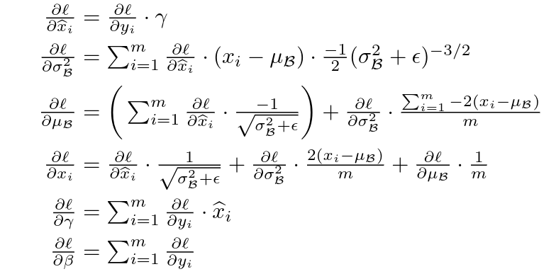
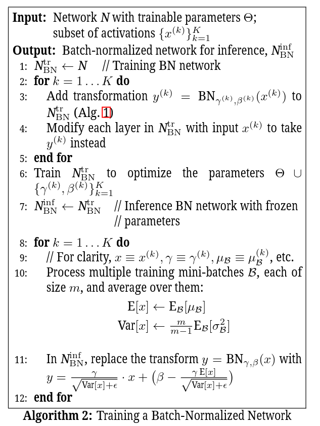

# Batch Normalization: Accelerating Deep Network Training by Reducing Internal Covariate Shift

> notoriously: 臭名昭著地
>
> ensemble：集成，一起
>
> as  opposed to：相对于
>
> amplify：扩大、放大
>
> as such：因此
>
> interperse：穿插
>
> derivate：衍生，推导
>
> differentiable：可微的
>
> regime：(数学、物理)发生...的条件
>
> symmetirc：对称的
>
> element-wise：元素层面的
>
> resilient：弹性的
>
> conjecture：推测，猜测
>
> photometirc：光度学
>
> distortion：失真、扭曲
>
> premise：前提，假定

# 一、Abstract

1. **internal covariate shift**(内部协变量偏移): 

因为深度神经网络每一层的**输入的分布**在训练时会随着前一层参数的变化而**变化**的，这使得深度神经网络的训练十分复杂。这需要我们降低**学习率**，仔细使用**参数初始化**方法，使得训练变**慢**了，并且也使得使用**饱和非线性激活函数**的模型**难以训练**。这一现象称作 internal covariate shift，简称ICS。

> Training Deep Neural Networks is complicated by the fact that the distribution of each layer’s inputs changes during training, as the parameters of the previous layers change. 
>
> This slows down the training by requiring lower learning rates and careful parameter initialization, and makes it notoriously hard to train models with saturating nonlinearities.

2. **解决方法—Batch Normalization**：

通过**正则化每层的输入**，可以解决ICS现象。

我们的方法将**正则化作为模型结构的一部分**并对每个训练**mini-batch**进行正则化。

**优点**：

+ Batch Normalization允许我们使用**更高的学习率**、**参数初始化方法**可随意点。
+ Batch Normalization像**正则化器**般作用，在某些情况下可以不需要Dropout。

**应用成绩**：

+ 在最好的图像分类模型上使用BN，获得相同的准确率，训练速度加快了14倍，并以显著的优势击败了原先的模型。
+ 使用集成BN的网络，提高了在ImageNet分类上的最好结果，在top-5 error上超过人类。

# 二、Introduction

**SGD**用于优化网络的参数$\Theta$，即最小化下面的损失函数：
$$
\Theta=\arg\min_{\Theta}\frac{1}{N}\sum_{i=1}^N\ell(x_i,\Theta)
$$
这里$x_{1...N}$是训练数据集。

在训练的每一步，使用**大小为m的mini-batch**，用来**近似关于参数损失函数的梯度**，通过计算：
$$
\frac{1}{m}\frac{\part \ell(x_i,\Theta)}{\part \Theta}
$$
使用mini-batch的好处：

+ **mini-batch的loss的梯度**是对训练集梯度的**估计**，随着batch size的增加，估计的质量提高。
+ 对**批量数据的计算**比计算m次单独的数据更有效，因为点带计算平台能够提供并行计算。

SGD需要**仔细调整模型的超参数**，尤其是优化的**学习率**、模型**参数的初始化值**。因为每层的输入受到之前网络层的影响，即使是对模型参数的微小改变也会随着网络的加深而放大，所以训练实际上是很复杂的。

**网络层的输入分布的改变**是一个问题，因为网络层需要连续调整到新的分布。当**学习系统的输入分布发生了变化**，即所谓的经历了**covariate shift**，这可以典型地通过**domain adaptation**解决。但是covariate shift的概念可以作为一个**整体**扩展超出学习系统，作为其一部分得到应用，比如**子网络或者网络层**。

考虑网络计算：
$$
\ell=F_2(F_1(u,\Theta_1),\Theta_2)
$$
这里$F_1,F_2$是任意的transformations，参数$\Theta_1,\Theta_2$是损失函数$\ell$ 要学习的参数。学习$\Theta_2$就可以看作是$x=F_1(u,\Theta_1)$作为下面子网络的输入：
$$
\ell = F_2(x,\Theta_2)
$$
一步梯度下降：
$$
\Theta_2\leftarrow \Theta_2-\frac{\alpha}{m}\sum_{i=1}^m\frac{\part F_2(x_i,\Theta_2)}{\part \Theta_2}
$$
batch size为m，学习率为$\alpha$。

因此，能够使训练更加有效的**输入分布的属性**，比如**训练、测试数据具有相同的分布**，也被应用到子网络。因此**x的分布一直保持固定**是有好处的，这样**$\Theta_2$就不需要重新调整**来弥补x的分布的变化。

**子网络的固定分布的输入对子网络之外的网络层也有正面影响。**如果保证非线性输入的分布保持稳定，那么优化器就不太可能在饱和状态停止，这样训练会加速。

We refer to the change in the distributions of internal nodes of a deep network, in the course of training, as **Internal Covariate Shift**.  

消除ICS一定能够获得更快的训练速度。因此我们提出了**Batch Normalization**，能够**减少ICS**，并且这样做能够**加速深度神经网络的学习**。BN通过**固定网络层输入的均值和方差**这一正则化步骤来获得效果。

BN的**优点**：

1. BN也能够**减少梯度对参数规模和参数初始化值的依赖**。这使得我们能够使用更高的学习率而没有发散的风险。

   > BN能实现数据分布稳定、权重分布稳定，所以不用精心设计权值初始化。

2. BN**正则化了模型**，并且**减少对Dropout的需要**。

3. BN通过防止网络阻塞在饱和状态，使得使用饱和非线性激活函数成为可能。

# 三、Towards Reducing Internal Covariate Shift

**白化(Whitened)**：如果输入被白化过了，网络训练拟合地更快，比如**线性变换到0均值，单位方差**，不相关。通过白化每层的输入，我们能够获得固定分布的输入，这样可以消除ICS的不良影响。

> We could consider whitening activations at every training  step  or  at  some  interval,  either  by  modifying  the network  directly  or  by  changing  the  parameters  of  the optimization  algorithm  to  depend  on  the  network  activation  values.
>
> 如果在优化步骤中穿插使用上面的方法，那么梯度下降需要使用新的正则话方法更新参数，这会降低梯度步骤的效果。

假设一个网络层的输入为u，要学习的偏置是b，通过减去对训练数据的激活值的均值来正则化结果：
$$
\hat{x}=x-E[x],\quad x = u + b, \quad \mathcal{X}=\{x_{1...N}\},\quad E[x]=\frac{1}{N}\sum_{i=1}^Nx_i
$$
如果梯度下降步骤中忽略$E[x]$对b的依赖，更新：$b\leftarrow b+\triangle b,\triangle b\propto -\part \ell/\part \hat{x}$，那么：
$$
u+(b+\triangle b)-E[u+(b+\triangle b)]=u+b-E[u+b]
$$
因此，对**b的更新和正则化的后续改变的结合会导致网络层输出没有变化**，或者，损失函数也没有变化。随着训练继续，**b的无限增加然而loss不变**。如果normalization不仅集中而且放大激活值，这个问题会变得更加严重，即**梯度爆炸**。

上面方法的问题在于**梯度下降优化没有考虑到normalization已经发生**。为了解决这个问题，我们要保证，**对于任何参数值，网络总是产生要求的分布的激活值**。这样做会**让关于参数的loss的梯度考虑到正则化和对模型参数$\Theta$的依赖。**

> To address this issue,we would like to ensure that,  for any parameter values,the network always produces activations with the desired distribution.
>
> Doing  so  would  allow  the  gradient of  the loss with respect to the model parameters to account for the normalization, and for its dependence on the model parameters Θ.  

白化的操作：

假设x是网络层的输入向量，$\mathcal{X}$是这些训练数据集上这些输入的集合。正则化操作为下面的转换：
$$
\hat{x}=\mathrm{Norm}(x,\mathcal{X})
$$
不仅依赖于输入x，还依赖于所有的examples $\mathcal{X}$，其中每一个都依赖于$\Theta$，如果x由其他网络生成。

在反向传播时，我们需要计算Jacobian矩阵：
$$
\frac{\part \mathrm{Norm}(x,\mathcal{X})}{\part x} \; and\; \frac{\part \mathrm{Norm}(x,\mathcal{X})}{\part \mathcal{X}}
$$
在这个框架下，白化还需要计算协方差矩阵$Cov[x]=E_{x\in \mathcal{X}}[xx^T]-E[x]E[x]^T$，以及其逆平方根，来产生白化激活：
$$
Cov[x]^{-\frac{1}{2}}(x-E[x])
$$
**每次参数更新之后需要分析整个训练集，代价太大**，需要找替代的正则化方法。

之前Lyu使用了通过单个训练实例计算的统计数据，或者，在图片网络中，使用给定位置的不同特征图计算的统计数据。但是这舍弃了激活的绝对比例，改变的网络的表示能力。我们希望保留网络中的信息，通过正则化与整个训练数据统计数据相关训练实例中的激活。

> However,  this  changes  the  representation  ability  of  a network by  discarding the  absolute scale  of activations.
>
> We want to a **preserve the information in the network**, by normalizing the activations in a training example relative to the statistics of the entire training data.

# 四、Normalization via Mini-Batch Statistics

**白化的缺点**：

1. 对每一层的输出进行白化**代价高**，并且**不是处处可微**的。

**两个重要的简化**：

1. 不是对层输入和输出的特征进行联合白化，而是对每个**常量特征单独正则化**，通过使其**均值为0，方差为1**。

   对d维输入$x=(x^{(1)},x^{(2)},...,x^{(d)})$，对每个维度进行正则化：
   $$
   \hat{x}^{(k)}=\frac{x^{(k)}-E[x^{(k)}]}{\sqrt{\mathrm{Var}[x^{(k)}]}}
   $$
   这里的均值和方差都是在训练数据集上计算得到的。在1998年LeCun的论文中已经揭示了，这个正则化可以**加速拟合**，即使特征并非不相关。

   仅仅对**每层输入进行正则化**可能**改变网络层表示的信息**。需要**保证插入到网络中的变换可以代表恒等变换**。

   对每个激活值$x^{(k)}$，一对参数$\gamma^{(k)},\beta^{(k)}$，对正则化值进行缩放与位移：
   $$
   y^{(k)}=\gamma^{(k)}\hat{x}^{(k)}+\beta^{(k)}
   $$
   这些**参数随着原来的模型参数一起被学习**，并**存储了网络的表示能力**。如果原先的激活函数是最优的，设置$\gamma^{(k)}=\sqrt{\mathrm{Var}[x^{(k)}]},\beta^{(k)}=E[x^{(k)}]$，可以恢复原先的激活操作。

   > 原先使用sigmod会存在中间的线性区，削弱了网络的表达能力，经过$y^{(k)}=\gamma^{(k)}\hat{x}^{(k)}+\beta^{(k)}$，可以解决。

2. **每个mini-batch产生每个激活值的均值和方差的估计值**，这样，用于正则化的数据能够**充分参与梯度反向传播**。

   注意在**计算每个维度的方差而不是联合协方差时，可以使用mini-batch**。在计算联合协方差的场景下，正则化是需要的，因为**mini-batch的大小可能小于白化的激活值的数量**，产生奇异值协方差矩阵(singular covariance matrices)。

   设mini-batch $\mathcal{B}$的大小为m，因为正则化是独立地应用到每个激活值，所以下面集中在特定的激活值$x^{(k)}$，为了清晰省略k。

   在mini-batch中有m个激活值：$\mathcal{B}=\{x_{1...m}\}$。

   令正则化值为$\hat{x}_{1...m}$，其线性变换为$y_{1...m}$，将$\mathrm{BN}_{\gamma,\beta}:x_{1...m}\rightarrow y_{1...m}$称为**Batch Normalization Transform**。算法如下：

   

   > $\epsilon$ is a constant added to the mini-batch variance for numerical stability.

$\mathrm{BN}_{\gamma,\beta}(x)$**依赖于训练样例和mini-batch中的其他样例**。只要每个mini-batch中样例采样自相同的分布，每个$\hat{x}$的分布应当是期望为0，方差为1，即$\sum_{i=1}^m\hat{x}_i=0,\frac{1}{m}\sum_{i=1}^m\hat{x}_{i}=1$。每个$\hat{x}^{(k)}$可以看作是子网络的输入，子网络由线性变换$y^{(k)}=\gamma^{(k)}\hat{x}^{(k)}+\beta^{(k)}$组成，后接原来网络进行的其他处理。**这些子网络的输入都有固定的均值和方差，尽管这些正则化的$\hat{x}^{(k)}$的联合分布在训练过程中会改变，**可以预料到正则化输入的引入可以加速子网络的训练，并最终加速整个网络的训练。

在反向传播过程中与BN变换相关参数的梯度计算(使用链式法则)：

因此，**BN变换是可微的变换，能够在网络中引入正则化的激活值**。这保证了在模型训练时，网络层能够在输入分布上持续学习，展现出更少的ICS，因此加速了训练。因此，**应用在这些正则化激活值上的可学习仿射变换能够表示横等变换，并保持了网络的能力**。

## 1. Training and Inference with Batch-Normalized Networks

> To Batch-Normalize a network, we specify a subset of activations and insert the BN transform for each of them, **Any layer that previously received $x$ as the input, now receives $BN(x)$.** 
>
>  A model employing Batch Normalization can **be trained using batch gradient descent,** or **Stochastic Gradient Descent** with a mini-batch size $m >1$, or with any of its variants such as **Adagrad**.

对**激活值的正则化** (依赖于mini-batch的) 使训练变得高效，但是这**在推理时既不必要也不需要**。我们希望输出仅仅并确切地依赖于输入。

因此，一旦网络已经被训练好，我们使用正则化：
$$
\hat{x}=\frac{x-E[x]}{\sqrt{\mathrm{Var}[x]+\epsilon}}
$$
使用整体(population)，而不是mini-batch，统计数据。忽略掉$\epsilon$，这些激活值在训练时具有相同的均值0，方差1。

> using  the  population,  rather  than  mini-batch,  statistics.

我们使用**无偏方差估计**(unbiased variance estimate)$\mathrm{Var}[x]=\frac{m}{m-1}\cdot \mathrm{E}_{\mathcal{B}}[\sigma_{\mathcal{B}}^2]$，这里的期望是训练大小为m的mini-batch的期望，$\sigma_{\mathcal{B}}^2$是样本方差。

> 存在问题：mini-batch的统计信息(均值和标准差)充当总体是不正确的。
>
> 解决方法：使用**指数滑动平均**(Exponential moving average)，我们能够**追踪模型训练时的准确率**。
> $$
> mv_t=decay*mv_{t-1}+(1-decay)*a_t\\
> mv_t=\sum_{i=1}^tdecay^{t-i}*(1-decay)*a_t
> $$
> $a_t$为当前值，$wv_t$为指数滑动平均值。

因为**在推理时均值和方差是固定的**，正则化仅仅是应用在激活值上的线性变换，可能有伸缩$\gamma$和偏移$\beta$来产生一个单独的线性变换代替$BN(x)$。

**训练batch-normalized网络的算法流程**：

## 2. Batch-Normalized Covolutional Networks

> Batch  Normalization  can  be  applied  to  any  set  of  activations  in  the  network.

关注由仿射变换和元素层面的非线性变换组成的变换：
$$
z=g(Wu+b)
$$
这里$W,b$是模型的可学习参数，$g(\cdot)$是非线性激活函数，这个是全连接层和卷积层的通用公式。

**通过正则化$x=Wu+b$，在非线性激活函数之前直接加上BN变换**。

因为**$Wu+b$更可能有对称的、非稀疏的分布**，即"more Gaussian"，**对其正则化可能产生具有稳定分布的激活值**。

> We could have also normalized the layer inputs $u$,  but since **$u$ is likely the output of another nonlinearity, the shape of its distribution is likely to change during training**, and constraining its first and second moments would not eliminate the covariate shift. 

注意，因为我们需要正则化$Wu+b$，因为后面的**减均值操作**，**前一层的偏置$b$是可以省略的**，那么：
$$
z=g(\mathrm{BN}(Wu))
$$
这里**BN变换独立地应用到了$x=Wu$的每个维度**，**每个维度都有一对可学习参数$\gamma^{(k)},\beta^{(k)}$。**

对于卷积层，除此之外，我们还希望**正则化能够遵守卷积性质**，这样**同一个特征图的不同位置的不同元素，能够用同样的方式正则化**。需要**联合正则化mini-batch中所有位置上的激活值**。

let $\mathcal{B}$ be the set of all values in a feature map across both the elements of a mini-batch and spatial locations – so for a mini-batch of size $m$ and feature maps of size $p×q$, we use the effective mini-batch of **==size $m′=|B|=m·p q$==.**  We **learn a pair of parameters $\gamma(k)$and$\beta(k)$ per feature map, rather than per activation.** 

> 即卷积层的BN变换是以特征图为单位学习参数，而不是激活值为单位的。

During inference the BN transform applies the same linear transformation to each activation in a given feature map.

## 3. Batch Normalization enables higher learning rates

 By  normalizing activations throughout the  network,  it **prevents small changes to the parameters from amplifying into larger** and **suboptimal changes in activations in gradients**.

> Batch Normalization also makes training more resilient to the parameter scale.

正常情况下，大学习率会使得网络层参数缩放比增大，这样会增大反向传播的梯度，导致梯度爆炸。但是，**使用BN，反向传播不会受到参数缩放的影响**，事实上，对于标量$a$：
$$
BN(Wu)=BN((aW)u)
$$
因为a会被缩放掉，因此：
$$
\frac{\part BN((aW)u)}{\part u}=\frac{\part BN(Wu)}{\part u}\\
\frac{\part BN((aW)u)}{\part (aW)}=\frac{1}{a}\frac{\part B(Wu)}{\part W}
$$
所以缩放不会影响网络层的Jacobian矩阵，最终不会影响梯度反向传播。此外，**更大的权重会带来更小的梯度，BN会使参数增长变稳定**。

We  further  conjecture  that  Batch  Normalization  may **lead the layer Jacobians to have singular values close to 1**,which is known to be beneficial for training.

考虑两个有正则化输入的连续网络层，这些正则化向量的变换：$\hat{z}=F(\hat{x})$，如果我们假设$\hat{x},\hat{z}$是Gaussian并且无关，$F(\hat{x})\approx J(\hat{x})$是给定模型参数的一个线性变换，那么$\hat{x},\hat{z}$都有单位协方差矩阵：
$$
I=\mathrm{Cov}[\hat{z}]=J \mathrm{Cov}[\hat{x}]J^T=JJ^T\\
JJ^T=I
$$
因此，J的所有奇异值都为1，这保留了反向传播中的梯度量纲。

事实上，变换并不是线性的，正则化值也不能保证是Gaussain、独立，但是我们仍然可以认为BN能够让梯度反向传播行为更好。BN在梯度传播的精确效果仍然是可以深入研究的领域。

## 4. Batch Normalization regularizes the model

有时候使用BN都可以不用Dropout，在batch-normalized的网络中，模型是正则化的。

# 五、Experiments

## 1. Activations over time

在MINST数据集上训练模型使用BN，具体看论文就行。

## 2. ImageNet classification

基于GoogLeNet v1的模型细节和改动。

> The  network  has  a  large  number  of  convolutional  and pooling layers, with a softmax layer to predict the image class, out of 1000 possibilities.  Convolutional layers use ReLU as the nonlinearity. 
>
> 5×5 convolutional layers are replaced by two consecutive layers of 3×3 convolutions with up to 128 filters.    
>
> 即借鉴了VGG的小卷积核思想，将$5\times 5$卷积替换成两个连续的$3\times3$卷积。
>
> The model was trained using a version of Stochastic Gradient Descent with momentum , using the mini-batch size of 32. The training was performed using a large-scale, distributed architecture.

### (1) Accelerating BN Networks

介绍了一堆对网络和训练参数的改变方面：

1. Increase learning rate.
2. Remove Dropout.
3. Reduce the L2 weight regularization.
4. Accelerate the learning rate decay.
5. Remove  Local  Response  Normalization.
6. Shuffle training examples more thoroughly.
7. Reduce  the  photometric  distortions.

### (2) Single-Network Classification

对一堆网络进行评价，在LSVRC2012训练数据集上训练，在测试数据集上测试。

1. Inception
2. BN-Baseline:  Same as Inception with Batch Normalization before each nonlinearity
3. BN-x5:  Inception  with  Batch  Normalization  and  the modifications，The initial learning rate was increased by a factor of 5, to 0.0075. 
4. BN-x30: Like BN-x5, but with the initial learning rate 0.045 (30 times that of Inception).
5. BN-x5-Sigmoid:  LikeBN-x5,  but with sigmoid non-linearity instead of ReLU.

这些网络加上BN之后和Inception对比：

+ 训练速度加快。
+ 允许更大学习率，尽管一开始训练慢，但是最终准确率更高。
+ 证实了ICS的减少允许使用BN的网络使用SIgmod这种饱和激活函数。

### (3) Ensemble Classification

For our ensemble, we used 6 networks. Each was based on BN-x30, modified via some of the following: 

+ increased initial weights in the convolutional layers; 
+ using Dropout(with  the  Dropout probability of  5%  or  10%,  vs.   40% for the original Inception); 
+ and using non-convolutional,per-activation Batch Normalization with last hidden layers of the model.   

Each network achieved its maximum accuracy after about $6·10^6$ training steps.  The ensemble prediction was based on the  arithmetic average of  class probabilities predicted by the constituent networks. 

# 六、Conclusion

看原文就行。

提出BN层：加快模型收敛，比googlenet-v1快了数十倍，并获得更好结果。

GoogLeNet-v2获得ILSVRC分类任务SOTA。

研究意义：

开启了神经网络设计新时代，**标准化层**已经成为深度神经网络标配。

> 后面在Batch Normalization基础上拓展出了一系列标准化网络层，如Layer Normalization (LN)， Instance Normalization (IN)， Group Normalization (GN)。

