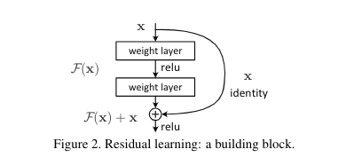

# Deep Residual Learning For Image Recognition

# 一、Abstract

本文提出了残差学习框架用来使非常深的网络的训练变得容易。

我们显式地将层变成关于层输入的残差函数，而不是学习未参考的函数。

我们提供了全面的经验证据显示这些残差网络更容易优化，并且能够通过显著地增加深度来提高准确率。

在ImageNet数据集上，我们评价了有152层深度的残差网络，其复杂度比VGG net要低。

# 二、Introduction

深度网络很自然地将低/中/高层次的特征和分类器以段到段多层的方式进行集成，特征的层次能够随着堆叠的层的深度增加而增加。最近有证据揭示了网络的深度很重要。

在深度的重要性的驱动下，一个问题产生了：**模型是否能够像网络层数增加那样容易地提高学习效果**？**梯度消失和梯度爆炸**这两个会从一开始阻碍拟合的问题，**已经被正则初始化参数和中间的正则化层解决了**，这使得有数十层的网络能够使用SGD和反向传播开始拟合。

当更深的网络开始拟合，一个退化问题就产生了：**随着网络深度的增加，准确率变得饱和，然后就会快速退化**。这退化并不是过拟合导致的，并且增加更多的网络层到合适的深度模型上会导致更高的训练误差。

训练准确率的退化表明了不是所有系统都是那么容易去优化。

考虑一个浅层的模型和其对应的增加了很多网络层的深层的对手。这里有一个通过构造解决深度模型的方法：**增加的网络层是恒等映射(identity mapping)，其他层是从浅层的模型拷贝过来的**。这种构造出来的解决方法表明深层模型应当不会产生比浅层模型更高的训练误差，但是实验表示目前的解决方法还没能找到能够和这个构造的方法相比甚至更好的方法。

我们显式地让这些网络层拟合一个残差映射，而不是希望每个堆叠的网络层直接拟合一个希望的隐藏的映射。形式上，我们将隐藏映射表示为$\mathcal{H}(x)$，让堆叠的非线性层拟合另外一个映射$\mathcal{F}(x)=\mathcal{H}(x)-x$，那么原来的映射是$\mathcal{H}(x)=\mathcal{F}(x)+x$。这个可以在前馈神经网络中使用**快捷连接(shortcut connection)**来实现，这里的快捷连接仅仅执行恒等映射，它们的输出会加到堆叠的网络层的输出上。这不需要任何额外的参数和计算复杂度。

我们在ImageNet上进行了复杂的实验来展示退化问题，并评价了我们的方法：

+ 我们的特别深的残差网络很容易优化，但是对手plain net随着网络深度的增加显示更高的训练误差。
+ 我们的深度残差网络能够很容易从增加的深度上获得正确率的提高，产生比之前网络更好的结果。

相似的结果在其他数据集和任务上出现，表明了深度残差网络具有很好的泛化能力。

# 三、Related Work

## 1. Residual Representation

在图像识别领域，VLAD是一种和字典相关的由残差向量编码的表示， Fisher vector是VLAD的概率版本。这两者都是图像检索和图像分类的强大浅层表示。对于向量的量化，编码残差向量被证明比编码原始向量更有效。

在低级视觉和计算机图形学，为了解决PDE，广泛使用的Mutigrid method在不同尺度将系统重构为子问题，每个子问题负责较粗尺度和较细尺度的残差解。Multigird的一个替代方法是hierarchical basis preconditioning，这依赖于表示两个尺度的残差向量的变量。已经证实这些求解器比不知道残差性质的标准求解器收敛得更快。

## 2. Shortcut Connections

快捷连接的理论与实践已经被研究了很长时间。早期的实践是训练多层感知机，通过添加一个线性层来链接网络的输入与输出。后面的研究中，一些中间层直接连接到辅助分类器，用于解决梯度消失/爆炸。有论文提出了通过快捷连接实现层间响应，梯度和传播误差的方法。

和我们同时进行的工作，”highway networks“提出了门功能的快捷连接，这些门是数据相关且有参数的。

# 四、Deep Residual Learning

## 1. Residual Learning

考虑一堆网络层要学习的映射$\mathcal{H}(x)$，x是这堆网络层的第一层的输入，假设最终的输出$\mathcal{H}(x)$和x形状相同，那么就变成学习$\mathcal{F}(x)=\mathcal{H}(x)-x$，而原来的就是$\mathcal{H}(x)=\mathcal{F}(x)+x$，虽然看上去没啥区别，但是学习的容易度不一样。

这个重构受到违反直觉的退化问题启发。如果增加的网络层被构造成恒等映射，那么深度模型的训练误差应当不会比浅层的高。退化问题显示解决器可能在使用非线性层拟合恒等映射上有困难。如果横等映射是最佳的，解决器可能驱使多层非线性曾的权值变成0来接近恒等映射。

在实际场景，不可能恒等映射是最佳的，但是我们的重构可能帮助预先处理问题。如果最佳的函数接近恒等映射而不是0映射，解决器会更容易找到与恒等映射有关的前提条件，而不是学习一个新的函数。

经过实验发现恒等映射提供了相当合理的先决条件。

## 2. Identity Mapping by Shortcuts

Define a building block:
$$
\mathrm{y}=\mathcal{F}(\mathrm{x},\{W_i\})+\mathrm{x}
$$
$\mathrm{x,y}$是这堆网络层的输入和输出，函数$\mathcal{F}(\mathrm{x},\{W_i\})$表示要学习的残差映射。

上图有两层网络层：
$$
\mathcal{F}=W_2\sigma(W_1\mathrm{x})
$$
这里$\sigma$表示ReLU，为了简化符号，偏置bias被忽略。$\mathcal{F}+x$操作由一个快捷连接和逐元素相加执行。

这里的快捷连接不会引入参数和计算复杂度。

$\mathrm{x}$和$\mathcal{F}$必须具有相同维度，如果不是(改变了输入输出的通道)，我们可以执行一个线性投影$W_s$来匹配维度：
$$
\mathrm{y}=\mathcal{F}(\mathrm{x},\{W_i\})+W_s\mathrm{x}
$$
$W_s$仅仅用来使得维度匹配，$\mathrm{x}$和$\mathcal{F}$具有相同维度的话不需要使用方阵，因为恒等映射已经足够。

残差函数也可以用来表示多个卷积层，逐通道地对两个特征图执行逐元素加法。

## 3. Network Architectures

### (1) Plain Network

### (2) Residual Network

## 4. Implementation

# 五、Experiments

## 1. ImageNet Classification

### (1) Plain Networks

### (2) Residual Networks

### (3) Identity vs. Projection Shortcuts

### (4) Deeper Bottleneck Architectures

### (5) 50-layer ResNet

### (6) 101-layer and 152-layer ResNet

### (7) Comparisons with State-of-the-art Methods

## 2. CIFAR-10 and Analysis

### (1) Analysis of Layer Response

### (2) Exploring Over 1000 layers

## 3. Object Detection on PASCAL and MS COCO

> residual: 剩余的，残差
>
> ensemble：套
>
> empirical：经验的
>
> notorious：臭名昭著的
>
> hamper：阻碍
>
> degradtion：退化
>
> identity map：恒等映射
>
> shortcut：近路，捷径
>
> in a fashion：以...方式
>
> image retrieval: 图像分类
>
> coarser: 粗糙的
>
> asymptotically：渐进地
>
> counterintuitive：违反直觉的
>
> precondition：预先处理、前提、先决条件、
>
> notation：符号
>
> projection：投影

