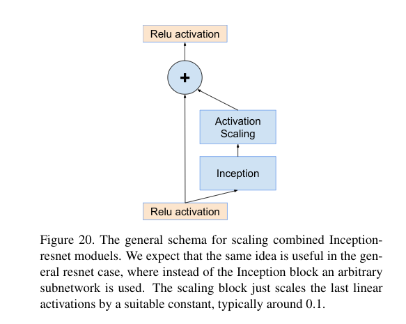

# Inception-v4, Inception-ResNet and the Impact of Residual Connections on Learning

## 0. Abstract

 training with residual connections accelerates the training of Inception networks significantly.

## 1. Introduction

1. **Residual connections are of inherent importance for training very deep architectures.** 

2. Since Inception networks tend to be very deep, it is natural **to replace the filter concatenation stage of the Inception architecture  with residual  connections**.

3. Besides a straightforward integration, we have also studied **whether Inception itself can be made more efficient by making it deeper and wider**. 
4. We will compare the two pure Inception variants, Inception-v3 and v4, with similarly expensive hybrid  Inception-ResNet  versions.
5. The last experiment reported here is an evaluation of an ensemble of all the best performing models presented here.

## 2. Related Work

AlexNet， Network in Network, VGGNet, GoogLeNet, Residual connections.

但是，这里并没有认为Residual connections一定是非常深的网络必须有的。

>  It might require more measurement points with deeper architectures to understand the true extent of beneficial aspects offered by residual connections.

虽然实验中发现不用residual connection仍然可以不那么困难地训练非常深的神经网络，但是使用residual connection可以加快训练速度。

## 3. Architectural Choices

### (1) Pure Inception blocks

Not simplifying earlier choices resulted in networks that looked more complicated that they needed to be.

In our newer experiments, for Inception-v4 we decided to shed this unnecessary baggage and made uniform choices for the Inception blocks for each grid size.

### (2) Residual Inception blocks

**Each Inception block is followed by filter-expansion layer( 1×1 convolution  without  activation)**  which  is  used  for scaling up the dimensionality of the filter bank before the addition to match the depth of the input. 

### (3) Scaling of the Residuals

我们发现如果卷积核的个数大于1000,残差的变种就会表现不稳定性，网络会在训练的早期“死亡”，意味着在平均池化前的最后一层在几万次迭代后只会产生0，这是无法避免的，不管是降低学习率还是增加额外的batch normalization。

**我们发现在和前一层的激活值相加之前减小残差的大小能够使训练稳定。**

> In general we picked some scaling factors between 0.1 and 0.3 to scale the residuals before their being added to the accumulated layer activations.

尽管缩小不是严格必要的，这似乎不会对最终的准确率产生影响，但是这有助于训练稳定。

代码就是`redsidual = self.conv1(redsidual) * 0.2 `.

## 4. Training Methodology

优化器: SGD

momentum: with a decay of 0.9

> RMSProp decay of 0.9, $\epsilon=1.0$， learning rate 0.045, decay every 2 epochs using a exponential rate of 0.94

## 5. Experimental Results

## 6. Conclusions

> revise：修改
>
> inherent：固有的
>
> ad hoc：临时的
>
> shield：盾，屏蔽
>
> replica：复制品，仿制品
>
> conservative:保守的
>
> shed：去除，掉落

