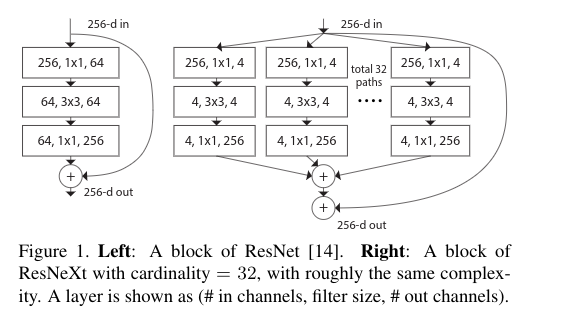
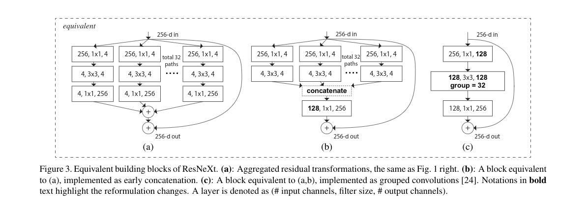

# Aggregated Residual Transformations for Deep Neural Networks

> aggregated: 汇总的，聚集的
>
> cardinality：基数
>
> homogeneous：同质的，由相同类型事物或人组成的
>
> compelling：强迫的，引人注目的
>
> tailor：量身定制
>
> customize：定制
>
> succinct：简明的
>
> redundancy：冗余，过多
>
> narrow：狭窄    narrow down：减少
>
> analogous：类似的
>
> nontrivial：非普通的  trivial：普通的
>
> trade-off：权衡

## 0. Abstract

提出ResNeXt网络结构，在深度和宽度之外又引入了另一个重要的因素“基数”(transformation集合的大小)，即使复杂度相同，增加基数也是可以提高分类准确率的。

## 1. Introduction

视觉检测的研究正咋i经历从特征工程到网络工程的转变，现在依靠神经网络从大量数据集中学习特征，现在人们主要对网络架构和学习的表示性进行研究。

VGG：堆叠相同形状的块。(stacking building blocks of the same shape).

Inception家族：通过精心设计网络拓扑结构，以较少的理论复杂度获得引人注目的准确率。Inception结构的重要属性：split-transform-merge策略。

In an Inception module, the input is split into a few lower-dimensional embeddings (by 1×1 convolutions) , transformed by a set of specialized filters (3×3,  5×5,etc.),  and merged by concatenation.

但是Inception结构也伴随着一些列的问题：卷积核数量和大小都是对单独的transformation量身定制的，模块逐阶段定制。我们不知道如何修改Inception结构来适应新的数据集/任务，尤其是有许多超参数要被设计时。

In  this  paper,  we  present  a  simple  architecture  which adopts  VGG/ResNets’  strategy  of  repeating  layers,  while exploiting the split-transform-merge strategy in an easy, extensible  way.

## 2. Related Work

1. 多分支卷积网络 (Multi-branch convolutional networks)。
2. 分组卷积 (Grouped convolutions)。从AlexNet开始的多GPU训练。
3. 压缩卷及网络 (Compressing convolutional networks)。
4. 集成 (Ensembling)。Averaging a set of independently trained networks is an effective solution to improving accuracy  , widely adopted in recognition competitions.

## 3. Method

### (1) Template

网络结构遵循由VGG/ResNet启发的两个规则：

+ 如果产生的空间图和输入的大小相同，那么该block的超参数相同(宽度和卷积核大小)。
+ 当空间图进行因数为2的降采样时，block的宽度乘2。

### (2) Revisiting Simple Neurons

简单神经元的计算公式：
$$
\sum_{i=1}^Dw_ix_i
$$
这也是一个split-transformation-merge的过程。

+ Splitting：向量$\mathrm{x}$被切分成低维的向量，即$x_i$。
+ Transforming：$w_ix_i$。
+ Aggregating：$\sum_{i=1}^Dw_ix_i$。

### (3) Aggregated Transformations

使用更为普遍的函数代替$(w_ix_i)$，该函数可以是一个网络，但是和NIN最终增加了维度的深度不同，我们的“Network in Nueron”在新维度上扩展。

我们使用下面的公式表示汇总的转换：
$$
F(\mathrm{x})=\sum_{i=1}^C\tau_i(\mathrm{x})
$$
这里$\tau_i(x)$可以是任意函数，和单个神经元相同，该函数将$\mathrm{x}$投影到一个向量(可选的低维的)上然后转换。

右图对应的汇总转换是作为残差函数的：
$$
\mathrm{y=x+\sum_{i=1}^C\tau_i(x)}
$$

Relation  to  Inception-ResNet：

+  it involves branching and concatenating in the residual function.
+ unlike all Inception or Inception-ResNet modules, we share the same topology among the multiple paths.  Our module requires minimal extra effort designing each path.

Relation to Grouped Convolutions: 看图。

我们注意到只有在block层数大于等于3时，重构才会产生非普通的拓扑，如果block的层数为2,那么重构会导致一个普通的宽而密的模块。

### (4) Method Capacity

模型参数数量的计算：
$$
C\cdot(256\cdot d+3\cdot3\cdot d \cdot d+d\cdot256)
$$

## 4. Implementation details

batch size 256， 8GPU，每个GPU 32个

输入图片 3 * 224 * 224， 随机截取，使用了AlexNet的数据增强方法。

shortcut：横等映射或投影映射。

降采样：3 * 3卷积，步长为2.

优化器： SGD

learning rate：0.1

weight decay：0.0001

momentum：0.9

每3个epoch学习率除10

使用了Kaiming 初始化

In all ablation comparisons, we evaluate the error on the single 224×224 center crop from an image whose shorter side is 256.

## 5. Experiments

### (1) Experiments on ImageNet-1K

**With cardinality C increasing from 1 to 32 while keeping complexity, the error rate keeps reducing.** 

Furthermore, the 32×4d ResNeXt also has a much lower training error than the ResNet counterpart, suggesting that the gains are not from regularization but from stronger representations.

**Increasing Cardinality vs. Deeper/Wider.**

和其他SOTA进行比较时也使用了多尺度裁剪。

### (2) Experiments on ImageNet-5K

### (3) Experiments on CIFAR

### (4) Experiments on COCO object detection

