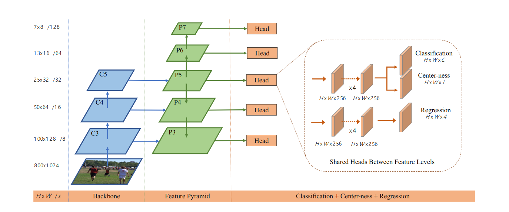

# FCOS: Fully Convolutional One-Stage Object Detection

## 一、Abstract

本文提出了不使用anchor和proposal的FCOS，通过去除对anchor boxes的预处理：

+ 避免了与achor boxes相关的复杂运算。
+ 没了与anchor boxes 相关的超参数。

使用了NMS和ResNeXt的FCOS，比一般的one-stage detecor的准确率高，简单，灵活。

## 二、Introduction

现在主流的目标检测算法Faster RCNN, SSD, YOLO都依赖于预处理过的anchor box，并且长期以来人们认为anchor box的使用是目标检测成功的关键。但是基于anchor的检测器有如下缺点：

1. detector 的表现对anchor box的大小，长宽比和数量敏感。
2. 因为achor box的大小、长宽比一直在被修改，那些detectors难以处理形态变化大的目标候选项，并且预定义的achor box也阻碍了detectors的泛化能力，针对有新的目标大小、长宽比的任务每次都需要重新设计。
3. 为了达到较高的召回率，基于anchor的detector需要在输入图像上密集地放置anchor，但是绝大多数的anchor是negative的，造成了训练过程总正样本和负样本数量的不均衡。
4. anchor box涉及到复杂的计算，比如IoU。

本文第一次提出了基于FCN的检测器，比基于anchor的要简单，表现更好。

在一些文章中，比如DenseBox，利用基于FCN的框架进行目标检测。这些基于FCN的框架直接在feature map层面上对所有空间位置预测了4D向量和一个类别标，与FCN在语义分割上类似。

但是，为了处理不同大小bounding box，DenseBox对训练图片进行裁剪和缩放到固定大小，因此，DenseBox需要对图像金字塔进行目标检测，不是一次性计算所有卷积。

并且，这些方法主要被用于特定领域，如人脸识别等，因为人们认为这些方法在应用到bounding box严重重叠的宽泛的目标检测时效果不佳。

> In the sequel, we take a closer look at the issue and show that with FPN this ambiguity can be largely eliminated. 

 

使用center-ness来减少距离目标对象中心较远的bounding box，以提高正确率。

本框架的优点：

+ Detection  is  now  unified  with  many  other  FCN-solvable tasks such as semantic segmentation, making it easier to re-use ideas from those tasks。
+ Detection  becomes  proposal  free  and  anchor  free,which significantly reduces the number of design parameters.
+ By  eliminating  the  anchor  boxes,  our  new  detector completely  avoids  the  complicated  computation  re-lated to anchor boxes such as the IOU computation and matching between the anchor boxes and ground-truth boxes during training, resulting in faster training and testing as well as less training memory footprint than its anchor-based counterpart。
+ Without  bells  and  whistles,  we  achieve  state-of-the-art results among one-stage detectors. 
+ The  proposed  detector  can  be  immediately  extended to solve other vision tasks with minimal modification,including instance segmentation and key-point detection.  

current mainstream detectors rely on a set of pre-defined anchor boxes, and it has long been believed that the use of 

## 三、Related Work

### 1. Anchor-based Detectors

1. 在基于anchor的目标检测器中，anchor boxes可以看作是预定义的sliding window或proposal，因此，在这些检测器中，anchors是被当成训练样本的。
2. 因为anchor box利用了CNN的特征图，比使用sliding window的Fast RCNN减少了重复的特征计算。而Faser RCNN，YOLO，SSD都使用这一设计。
3. 但是anchor box会造成大量的超参数需要处理; 而且基于achor的detector也需要其他超参数来标记每一个anchor box的正负。这些超参数也对正确率造成了影响。

### 2. Anchor-free Detectors

1. YOLO v1在目标中心附近点预测bounding box，但因为只使用中心附近的点，YOLO v1的recall较低，然后YOLO v2也使用了achor box。

2. FCOS利用的groud truth bounding box中的所有点来进行预测，而那些低质量的检测的bounding box会被本文提出的`center-ness`给抑制。因此FCOS能够提供和基于anchor的detector相比较的召回率。

3. CornerNet需要复杂的后验将同一个实例的角落合并，为了实现合并又用了额外的距离;

   而另一大类基于DenseBos的不使用anchor的detector，这类detector被认为是不适合广泛的目标检测的，因为处理重叠的bounding box很困难，并且召回率很低。

   而在FCOS中，处理bounding box变得容易，并且召回率提高了。

## 四、Our Approach

### 1. Fully Convolutional One-Stage Object Detector

$F_i\in R^{H\times W\times C}$：CNN backbone的第i层的feature map。

$s$：直到当前层的总步长。

$B_i=(x_0^{(i)},y_0^{(i)},x_1^{(i)},y_1^{(i)},c^{(i)})\in R^4\times \{1,2,...,C\}$: $(x_0^{(i)},y_0^{(i)}),(x_1^{(i)},y_1^{(i)})$表示bounding box的左上角和右下角。$c_i^{(i)}$表示bounding box中的目标类别。$C$是目标的类数。

对特征图$F_i$上的位置$(x,y)$，我们可以将其映射到输入图像上的$(\lfloor\frac{s}{x}\rfloor+xs,\lfloor\frac{s}{2}\rfloor+ys)$位置，该位置靠近$(x,y)$位置的感受野中心。

基于anchor的检测器将输入图像上的每一个位置当作anchor box的中心然后使用这些anchor box回归目标bounding box。

FCOS直接在位置上回归目标bounding box。换句话说，FCOS直接将位置看作训练样本，这一点和FCN用于语义分割一样。

特别地，如果$(x,y)$落在任何ground truth box中，并且其类别标签$c^*$和ground truth box的类别标签一样，那么认为$(x,y)$样本是正样本。否则认为$(x,y)$是负样本且$c^*=0$(背景的类别)。

除了用于分类的标签，还有4D实向量$\boldsymbol{t}^*=(l^*,t^*,r^*,b^*)$作为位置的回归对象，这里$l^*,t^*,r^*,b^*$是位置到bounding box左、上、右、下边界的距离。、

如果一个位置落入了多个bounding box，那么认为其是ambiguous sample。我们仅仅选择具有最小区域的bounding box作为回归对象。但是，伴随着multi-level prediction，ambiguous smaple可以被极大地减少，因此它们很难对检测表现产生影响。

形式上来说，如果位置$(x,y)$与bounding box $B_i$相关，位置的训练回归目标可以这么计算：
$$
l^*=x-x_0^{(i)}\quad t^*=y-y_0^{(i)}\\
r^*=x_1^{(i)}-x\quad b^*=y_1^{{(i)}}-y
$$
值得注意的是FCOS能够利用尽可能多的前景样本来训练回归器，而基于anchor的检测器只会将具有高IoU的anchor考虑为正样本。

#### (1) Network Outputs

考虑到使用的是80类别的数据集，模型的输出是一个80D的向量p(表示标签)，以及一个4D的向量$t=(l,t,r,b)$的bounding box坐标。

FCOS训练的不是多分类器，而是C个二分类器。

因为回归的目标总是的正的，FCOS将$\exp(x)$用于在回归分支顶端将实数映射到$(0,+\infty)$。

It is worth noting that FCOS has 9×fewer network output variables than the popular anchor-based detectors with 9 anchor boxes per location。

#### (2) Loss Function

FCOS的损失函数如下：
$$
L(\{\boldsymbol{p}_{x,y}\},\{\boldsymbol{t}_{x,y}\})=\frac{1}{N_{pos}}\sum_{x,y}L_{cls}(\boldsymbol{p}_{x,y},c^*_{x,y})\\+\frac{\lambda}{N_{pos}}\sum_{x,y}\mathcal{I}_{\{c^*_{x,y}>0\}}L_{reg}(\boldsymbol{t}_{x,y},\boldsymbol{t}^*_{x,y})
$$
这里$L_{cls}$是focal loss， $L_{reg}$是IOU Loss，$N_{pos}$表示正样本的个数，$\lambda$是对$L_{reg}$的平衡权重。

这个求和是对feature map $F_i$上的所有位置进行计算后求和。

$\mathcal{I}_{\{c_i^*>0\}}$是指示函数，如果$c_i^*>0$则为1,否则为0。

#### (3) Inference

FCOS的推理是直接的。给定一个图片，我们将其通过网络前向传播，然后获得特征图$F_i$上每一个位置的分类得分$\boldsymbol{p}_{x,y}$以及回归预测$\boldsymbol{t}_{x,y}$。接下来我们选择$p_{x,y}>0.05$的位置作为正样本去获得预测的bounding box。

### 2. Multi-level Prediction With FPN  for FCOS

FCOS可能存在的两个问题都可以被使用FPN的多标签预测解决：

+ 最后在CNN特征图上的大步长会导致BPR相对较低。
  + 基于anchor的检测器可以通过降低要求的IoU分数来弥补。
  + 但是FCOS同样可以做到甚至比基于anchor的更好。
  + 通过使用多标签预测，FCOS的BPR可以进一步提高。
+ grounding truth box的重叠会引起的难以处理的二义性问题也可以被多标签预测很好地解决。

FCOS的网络结构图如下：

基于anchor的检测器对不同的feature level分配不同的anchor box，而FCOS限制了每层的bounding box regression的范围。

一开始对所有特征层的每一个位置计算回归目标$(l^*,t^*,r^*,b^*)$，如果$\max(l^*,t^*,r^*,b^*)<m_i$或$\max(l^*,t^*,r^*,b^*)<m_{i-1}$，那么就设置为负样本，后面这里就不需要再回归bounding box了。这里$m_i$是每个特征层要求回归的最大距离。

因为不同尺寸的物体被分配到的不同的特征层，并且绝大多数重叠发生在大小极大不同的物体之间。如果一个位置，即使使用了多层预测，还是被分配到了多余一个的ground-truth box，我们就选最小的那个作为目标。多层标签预测可以大幅减轻二义性，将基于FCN的检测器提升到和基于anchor的检测器相同水平。

最终，FCOS会在不同特征层之间共享head，不仅仅让检测器能够有效地处理参数，而且也提高了检测表现。但是，我们观察到不同的特征层被要求回归不同大小的范围，因此给不同特征层使用相同的head有点不明智。因此，最终没有用$exp(x)$，而是用$\exp(s_ix)$，这里$s_i$是一个可学习标量，用于针对不同特征层自动调整对数函数的基底。这稍微提升了检测的表现。

### 3. Center-ness for FCOS

因为有很多低质量的由原理目标中心的位置产生预测回归bounding box，FCOS的表现还是和基于anchor的检测器有差距，接下来提出了center-ness。

在没有引入超参数的情况下，FCOS添加了一个层的分支，和分类分支平行，用于预测一个位置的centerness。center-ness 描述了从位置到目标中心的正则化距离：
$$
centerness^*=\sqrt{\frac{\min(l^*,r^*)}{\max(l^*,r^*)}\times\frac{\min(t^*,b^*)}{\max(t^*,b^*)}}
$$
使用sqrt来减缓center-ness的衰减速度，center-ness在$(0,1)$之间变化，并且被BCE(binary cross entropy)损失函数训练。

在测试的时候，最终的分数(用于对检测到的bounding box排序)用centerness乘以对应类别的分数。因此centerness可以降低远离目标中央的bounding box的权重，这些低质量的bounding box会被最终的NMS过程筛掉，极大地提升了检测表现。

## 五、Experiments

experiments are conducted on the large-scale detec-tion benchmark COCO，use  the  COCO trainval35k split (115K images) for training and minival split (5K images) as validation for our ablation study。

1. **训练细节**：

   + ResNet-50 被用作 backbone，并且使用了和RetinaNet相同的超参数。
   + 模型使用SGD迭代训练90K次，初始学习率0.01, mini-batch 为16张图片，在60K次和80K次迭代学习率减低10倍。权值衰减设置为0.0001，动量设置为0.9.
   + 使用在ImgaeNet训练的参数初始化backbone网络。
   + 输入图片被缩放到$800\times 1333$。

2. **推理细节**：

   + 输入一张图片通过网络前向传播，然后获得一个预测的bounding box和类别标签。
   + 接下来的后处理阶段与RetinaNet一样，并且直接使用和RetinaNet后处理阶段相同的超参数。
   + FCOS的表现还可以继续提升，如果能够仔细处理这些超参数。

   

### 1. Ablation Study

#### (1) Multi-level Prediction with FPN

基于FCN的检测器的两个主要问题：

+ 召回率低。
+ 二义性样本。

> 这两个都是因为ground-truth box重合导致的，也都可以通过多层次预测来解决。

1. **Best Possible Recalls**：
   +  BPR is defined as the ratio ofthe number of ground-truth boxes a detector can recall atthe most divided by all ground-truth boxes.
   + The first concern about the FCN-based detector is that it might not provide a good best pos-sible  recall  (BPR). But infact it is not neccessary.
2. **Ambiguous Samples**:
   + Another concern about the FCN-based detector is that it may have a large number of ambiguous samples due to the overlapping in ground-truth bounding boxes.
   + There are a large aoumnt of ambiguous samples if FPN is not used and only feature level P4 is used.
   + However, with FPN, the ratio can be significantly reduced since most of the overlapping objects are assigned to different feature levels.
   + 即使导致样本二义性的是两个相同类别物体的重叠也没有关系，因为预测总是匹配正确的类别。缺失的那个目标可以在其他地方预测它。
   + 因此，只需要考虑不同类别目标之间的bounding box的重叠。
   + 多层次预测可以减少ambiguous sample的比例，因此ground-truth bounding box之间的重叠就不成为基于FCN的FCOS的问题了。
   + 在FCOS中，由二义性位置产生的bounding box占比很少，而因为每一个位置ground-truth中的较小者绑定，所以FCOS最多就是冒着丢失一些更大的目标的风险。

#### (2) With or Without Center-ness

提出centerness来抑制远离目标中心的位置产生的低质量的检测的bounding box，可以提高FCOS的AP。

+ 基于anchor的RetinaNet采用了两个IoU阈值用来标记anchor box为正/负样本，这也可以抑制低质量的预测。
+ 使用center-ness可以去掉两个超参数，但是如果center-ness和anchor box一起使用的话可以获得更好的结果。

#### (3) FCOS vs. Anchor-based Detectors

FCOS和标准的RetinaNet相比有两个小地方不同：

+ 在新加的卷积层后面增加了Group Normalization(除了最后一层预测层)，这使得训练更加稳定。

  但是即使不加GN，FCOS也不比基于anchor的检测器差。

+  We use P5 to produce the P6 and P7 instead of C5 in the standard RetinaNet. We observe that using P5 can improve the performance slightly。

+ 值得注意的是，我们直接使用了来自RetinaNet的所有超参数，这些超参数为基于anchor的检测器优化过了。我们认为如果这些超参数被调好后，FCOS的表现可以再提升。

### 2. Comparison with State-of-the-art Detectors

FCOS可以做到比RetinaNet，Faster RCNN等更好的效果。

##  六、Extensions on Region Proposal Networks

FCOS和FPN可以代替two-stage的检测器Faster RCNN中的Region Proposal Networks中的anchor box。

## 七、Conclusion

本文提出了不使用anchor和proposal的one-stage检测器FCOS。

FCOS在表现上能够和RetinaNet，YOLO，SSD等相比，而设计复杂度降低了。

FCOS完全避免了与anchor box相关的计算和超参数，并解决了每个像素的目标检测预测，这一点和其他密集预测任务相似，比如语义分割。

FCOS同样获得的在one-stage 检测器中的最好的效果。

FCOS可以用在two-stage检测器中的RPN中，并且能够提高其性能。

> shape variation: 形态变化
>
> hamper：妨碍
>
> analogue：相似的
>
> leverage：利用
>
> in the sequel：结果
>
> alleviate：缓和
>
> reformulate：重新制定
>
> summation：总和，和
>
> intractable：棘手的
>
> alleviate：减轻，缓和
>
> identical：一样的