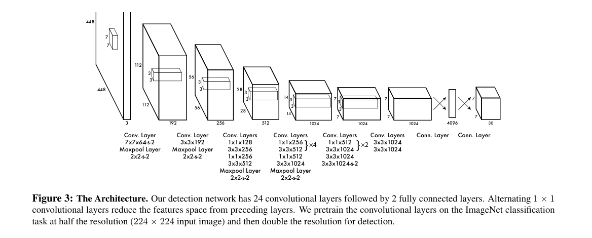
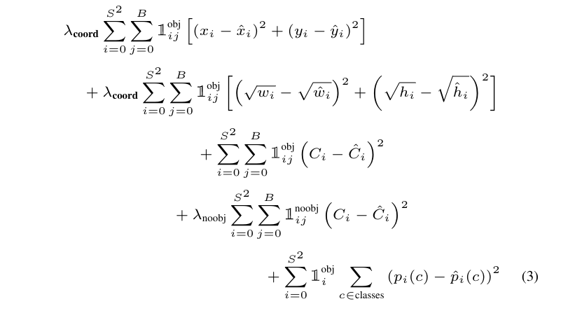
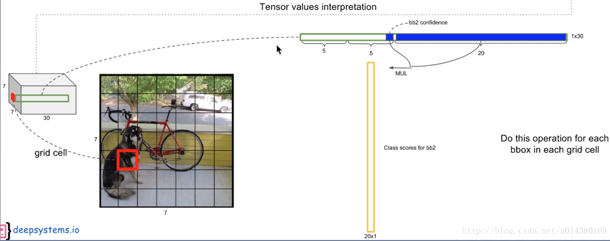

# You Only Look Once: Unified, Real-Time Object Detection

> repurpose：重新利用
>
> responsive：反应灵敏的
>
> pipeline：流水线
>
> be conditioned on：取决于
>
> overpower：压倒
>
> metric：测量标准
>
> impose：强制实行
>
> coarse：粗大的，粗糙的，粗劣的
>
> deformable：可变形的
>
> mitigate：减轻，缓和
>
> extant：现存的

## 0. Abstract

本文提出了YOLO，一个目标检测的新方法。

之前在目标检测方面的工作重新利用分类器来进行分类。相反，我们**将目标检测变成分割空间的边框和相关类概率的回归问题**。

> Instead, we frame object detection as a regression problem to spatially separated bounding boxes and associated class probabilities.

单个神经网络在**一次评估中直接从输入图片预测边框和类概率**。

> A single neural network predicts bounding boxes and class probabilities directly from full  images in one evaluation.  

因为整个**检测过程就是一个神经网络**，它可以在检测表现上进行**端到端优化**。

> Since the whole detection pipeline is a single network, it can be optimized end-to-end directly on detection performance.

YOLO的速度非常快，每秒可以处理45帧图片，更小版本的Fast YOLO可以每秒处理155帧图片同时还获得其他实时检测器2倍的mAP。

和其他最好的检测系统相比，**YOLO有更多的定位错误，但是更不容易预测错误预测正样本为背景**。

> Compared to state-of-the-art detection systems, YOLO makes more localization errors but is less likely to predict false positives on background.

YOLO还拥有良好的泛化能力，从自然图片到艺术品等领域都有良好的表现。

## 1. Introduction

快速、准确的目标检测算法的意义：

+ 自动驾驶，计算机不需要特殊的传感器来控制汽车，允许辅助设备给使用者传递实时的场景信息。
+ 解锁通用的、反应灵敏的机器人系统的可能性。

**传统目标检测算法的原理**：

重新使用分类器来进行目标检测，为了检测一个目标，这些系统会使用一个**针对该目标的分类器对测试图片上的不同位置和尺寸进行评价**。比如DPM (deformable parts models)就是使用了滑动窗口方法，在每个空间位置使用分类器进行分类。

**R-CNN系列目标检测算法的原理**：

R-CNN系列目标检测算法使用**候选区域方法**(region proposal)**首先产生图片中可能的边框，然后在这些边框中运行分类器**。

>  first generate potential bounding boxes in an image and then run a classifier on these proposed boxes.

在**分类之后，微调边框，消除重复的检测，然后对基于其他场景的物体的边框重新评分**。

> After classification, post-processing is used to refine the bounding boxes,  eliminate duplicate detections,  and rescore the boxes based on other objects in the scene.

这复杂的流水线是非常缓慢的，并且因为每个独立的部分需要单独训练，所以很难优化。

YOLO算法将目标检测作为一个回归问题，直接从图片像素到边框坐标和类别概率。

YOLO的优点：

+ 很快。延迟小，还可以用在视频目标检测上。

+ YOLO在预测时使用了图片的全局信息，能够隐式将关于类别和其外表的上下文信息隐式编码。

  > YOLO  sees  the  entire  image during training and test time so it implicitly encodes contextual information about classes as well as their appearance.

  因此YOLO在背景错误上较少。

+ YOLO具有良好的泛化能力。

但是YOLO的精度不如R-CNN系列，这算是在速度和精度上的权衡。

> YOLO v1的缺点：
>
> + 一个grid只能识别一种物体，即使一个grid能产生多个bounding box。
> + Bounding box的预测准确度是不如R-CNN这样的Region-based方法。

## 2. Unified Detection

**YOLO将单独的目标检测部分统一到了单个网络中**，使用从整张图片中获得特征来预测每个边框，同时对一张图片中的所有边框、所有类进行预测。

> We unify the separate components of object detection into a single neural network.  Our network uses featuresfrom the entire image to predict each bounding box. It also predicts all bounding boxes across all classes for an image simultaneously.

YOLO**将输入图片分成$S\times S$个方格，如果一个目标的中心落到一个方格单元，就认为这个方格负责检测该目标**。

每个方格单元预测$B$个边框以及这些边框的置信度。

> Each grid cell predicts B bounding boxes and confidence scores for those boxes.

这些置信度反映了模型对于该边框包含一个目标的自信程度，以及它认为边框预测的准确度。

> These confidence scores reflect how confident the model is that the box contains an object and also how accurate it thinks the box is that it predicts.

**置信度的定义**：
$$
\mathrm{Pr(Object)*IOU^{truth}_{pred}}
$$
如果边框不含目标，那么置信度为0，否则为IOU。

每个边框包含5个预测：$x,y,w,h$和置信度，$(x,y)$坐标表示与方格单元相关的边框的中心，宽度和高度是关于整张图片的预测，最后置信度的预测表示预测边框和真实边框的IOU。

每个方格单元也会预测C个类型概率，记做$\mathrm{Pr(Class_i|Object)}$，这些概率取决于包含目标的方格单元。每个方格单元我们仅预测一个类型概率的集合，不论边框数量$B$。

**在测试时，我们将条件概率和单独的边框置信度预测相乘**：
$$
\mathrm{Pr(Class_i|Object)*Pr(Object)*IOU^{truth}_{pred}=Pr(Class_i)*IOU^{truth}_{pred}}
$$
这给出了**每个边框的每个类型的置信度分数**。**这些分数将出现在边框中的类型的概率和预测的边框与目标的匹配程度进行编码。**

> These scores encode both the probability of that class appearing in the box and how well the predicted box fits the object.

>在PASCAL VOC数据集上，YOLO使用S = 7, B = 2，PASCAL数据集有20个标记的类别，即C = 20,最终的预测结果是$7\times7\times30$的张量。

### (1) Network Design

YOLO的网络结构受到GoogLeNet结构启发，有24个卷积层接2个全连接层，与Inception结构不同的是，YOLO仅使用了$1\times1$归约网络层后接$3\times3$网络层，和Lenet相近。

### (2)Training

在ImageNet 1K 上预训练了卷积神经网络，使用前20层卷积层和一个全连接层进行预训练，训练和推理都是使用Draknet框架。

之后将模型转成进行目标检测的，有研究表明向预训练网络添加卷积层或全连接层都可以提高表现，添加4层卷积层和两个全连接层，使用随机参数初始化。目标检测需要质量较高的视觉信息，所以我们将网络输入的分辨率从$224\times 224$提高到$448\times448$。

最后一层预测类别概率和边框坐标。将边框宽度、高度使用图片的高度、宽度正则化，使其落在0, 1之间。将边框的x，y坐标参数化成为特定方格单元位置的偏移，这样它们也包围在0, 1之间了。

>  We normalize the bounding box width and height by the image width and height so that they fall between 0 and 1. 
>
>  We parametrize the bounding box x and y coordinates to be offsets of a particular grid cell location so they are also bounded between 0 and 1.

> Bounding box的细节的理解：
>
> + 如果输出的位置坐标是一个任意的正实数，模型很可能在大小不同的物体上泛化能力有很大的差异。
> + 让真实的x除以grid的宽度，真实的y除以grid的高度进行正则化。
> + w除以整张图片的宽度，h除以整张图片的高度。

使用leaky_relu激活函数:
$$
\psi(x)=\left\{
\begin{matrix}
&x,\quad &if \; x > 0\\
&0.1x,\quad &otherwise
\end{matrix}
\right.
$$
使用平方和损失函数，因为容易优化，但是这无法完美地和我们最大化平均准确率的目标匹配，**平方误差将定位误差和分类误差的权重设为一样的，这可能不是最理想的**。

>  It weights localization error equally with classification error which may not be ideal.

并且，在每张图片中许多方格单元不包含目标，导致很多单元的置信度变成0，压倒了其他包含目标的单元的梯度。这回导致模型不稳定，导致训练在早期发散。

>  in  every  image  many  grid  cells  do  not  contain  any object.  This pushes the “confidence” scores of those cells towards  zero,  often  overpowering  the  gradient  from  cells that do contain objects.  This can lead to model instability,causing training to diverge early on.

为了解决这个问题，我们增大来自边框坐标预测的损失函数，减小来自不包含目标的边框的置信度预测的损失函数。使用两个参数$\mathrm{\lambda_{coord},\lambda_{noobj}}$来实现，设置$\mathrm{\lambda_{coord}=5, \lambda_{noobj}=0.5}$。

**平方误差也将大边框和小边框的对于小误差的权重设置为一样的**。我们的误差测量标准应当反映大边框的偏差重要性不如小边框的。为了部分解决这个问题，**我们需要预测边框宽度和高度的平方根，而不是直接预测宽度和高度**。

>  Our error metric should reflect that small deviations  in  large  boxes  matter  less  than  in  small boxes.  
>
> To partially address this we predict the square root of the bounding box width and height instead of the width and height directly.

YOLO对每个方格单元预测多个边框。在**训练时我们只希望一个边框预测器对目标起作用。我们根据预测的IOU高低选择预测器**，这导致了**边框预测器的特化**。**每个预测器在预测特定大小，长宽比或者某种类别目标有更好的效果，提高了整体召回率**。

YOLO采用下面的损失函数(分成多个部分)：

+ 定位预测误差：
  $$
  \mathrm{\lambda_{coord}\sum_{i=0}^{S^2}\sum_{j=0}^BI^{obj}_{ij}[(x_i-\hat{x}_i)^2+(y_i-\hat{y}_i)^2]}
  $$
  解决小偏差对大边框和小边框的的不同作用：
  $$
  \mathrm{\lambda_{coord}\sum_{i=0}^{S^2}\sum_{j=0}^BI_{ij}^{obj}[(\sqrt{w_i}-\sqrt{\hat{w}_i})^2+(\sqrt{h_i}-\sqrt{\hat{h}_i})^2]}
  $$

+ 置信度误差(分类误差)：
  $$
  \mathrm{\sum_{i=0}^{S^2}\sum_{j=0}^BI_{ij}^{obj}(C-\hat{C}_i)^2+\lambda_{noobj}\sum_{i=0}^{S^2}\sum_{j=0}^BI_{ij}^{noobj}(C_i-\hat{C}_i)^2}
  $$
  含有目标的边框的置信度和不含目标的边框的置信度误差，$C_i$表示置信度。

+ 类别预测：
  $$
  \sum_{i=0}^{S^2}I_i^{obj}\sum_{c\in classes}(p_i(c)-\hat{p}_i(c))^2
  $$

$I_i^{obj}$表示目标出现在方格单元i中，$I_{ij}^{obj}$表示方格单元 i 的第 j 个边框预测器对该预测负责。

这个损失函数惩罚了定位误差和分类误差。

>  the loss function only penalizes classification error if an object is present in that grid cell (hence the conditional class probability discussed earlier)
>
> It also only penalizes  bounding  box  coordinate  error  if  that  predictor  is “responsible”  for the ground truth box (i.e.  has the highest IOU of any predictor in that grid cell)

训练细节：

+ 在PASCAL VOC 2007， 2012上训练

+ Batch size： 256

+ momentum 0.9， decay 0.0005

+ 学习率调整策略：

  For  the  first epochs we slowly raise the learning rate from 10−3 to 10−2.

  If we start at a high learning rate our model often diverges due to unstable gradients.  

  We continue training with 10−2 for 75 epochs, then 10−3 for 30 epochs, and finally 10−4 for 30 epochs.

+ 为了避免过拟合，使用dropout和额外的数据增强。

  在地一个全连接层之后使用一个p = 0.5的dropout层。

  数据增强：引入随机缩放和至多到原来大小的20%的平移。

   We also randomly adjust the exposure and saturation of the image by up to a factor of 1.5 in the HSV color space.

### (3) Inference

推理跟训练一样。

方格设计使得边框预测有空间多样性。通常一个目标落在的方格单元是清楚的，网络只会为每个目标预测一个边框。

> Often  it  is  clear  which  grid  cell  an object falls in to and the network only predicts one box for each object.

但是，一些大目标或者在多个单元边缘的目标会被多个单元很好地定位，这时需要非极大值抑制 (NMS)。

关于模型输出，这里是$7\times7\times30$，$7\times7$是grid数量，$30$中包含边框预测结果还有分类结果，边框预测结果5个值，分类结果20个，一共就是$5\times2+20=30$。

假设有$S\times S$个grid，每个grid的边框个数为B，分类器可以识别出C种不同的物体，那么整个ground truth的长度为：
$$
S\times S\times(B\times 5+C)
$$

### (4) Limitations of YOLO

YOLO强制实行了对边框预测的非常严格的空间约束，因为每个方格单元只能预测两个边框，只能拥有一个类别。

空间约束限制了附近模型可以预测的目标的数量。YOLO在处理群体中小目标的小目标上有困难。

因为模型从数据中学习预测边框，所以在具有新长宽比或设置的目标的泛化上有困难。

模型也使用相对粗糙的特征来预测边框，因为模型有多个降采样层。

>  our loss function treats errors the  same  in  small  bounding  boxes  versus  large  bounding boxes. A small error in a large box is generally benign but a small error in a small box has a much greater effect on IOU. Our main source of error is incorrect localizations.

## 3. Comparison to Other Detection Systems

和DPN，R-CNN及其变种，Fast ，Faster R-CNN，Deep MultiBox， OverFeat，MultiGrasp。

## 4. Experiments

### (1) Comparison to Other Real-Time Systems

### (2) VOC 2007 Error Analysis

### (3) Combining Fast R-CNN and YOLO

### (4) VOC 2012 Results

### (5) Generalizability: Person Detection in Artwork

## 5. Real-Time Detection In The Wild

## 6. Conclusion

