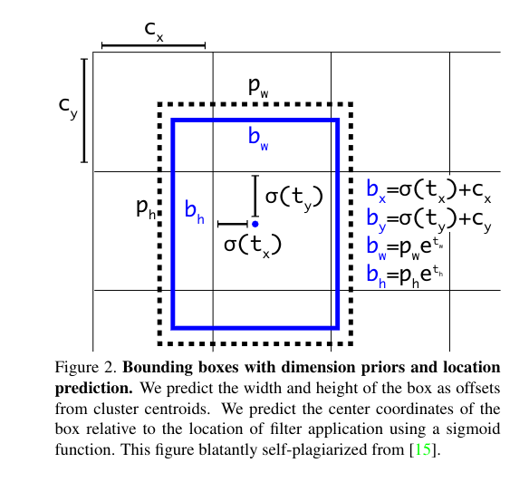

# YOLOv3： An Incremental Improvement

这有点像演讲稿。。。虽然投到了arXiv上。

> swell: 膨胀，变大
>
> contemplate：思考
>
> incur：导致，带来
>
> cryptic：隐晦难懂的

## 0. Abstract

提出对YOLO的一些改进，新的YOLO虽然变大了，但是也更加准确了，不过还是很快，相同mAP下YOLO比RetinaNet快3倍。

## 1. The Deal

### (1) Bounding Box Prediction

在YOLO9000使用维度聚类作为anchor box后，新的网络对每个bounding box预测4个坐标，$t_x,t_y,t_w,t_h$，如果方格单元相对图片左上角的偏移(坐标)为$(c_x,c_y)$，bounding box的先验宽度、长度为$p_w,p_h$，那么预测对应于：
$$
\begin{aligned}
&b_x=\sigma(t_x)+c_x\\
&b_y=\sigma(t_y)+c_y\\
&b_w=p_we^{t_w}\\
&b_h=p_he^{t_h}
\end{aligned}
$$
训练时使用平方误差损失函数(L2损失函数)。如果一些坐标预测的ground truth是$\hat{t}_*$，我们的梯度为ground truth的值减去我们的预测值: $\hat{t}_*-t_*$(ground truth value从ground truth box计算得来，可以通过上面的公式计算)。

YOLO v3使用logistic regression预测每个bounding box的objectness score。

+ 如果先验bounding box和ground truth object超过其他先验bounding box，那么这应当是1.
+ 如果一个先验bounding box的分数不是最好的，但是超过了我们忽略预测的阈值，这里用0.5。

不像Faster R-CNN，**YOLO v3给每个ground truth object分配一个先验bounding box，如果一个先验bounding box没有分配给一个bounding box object，它不会给坐标或者类型预测带来损失，只给objectness带来损失。**

### (2) Class Prediction

每个边框预测类别，一个边框可能包含使用多标签分类。

> Each box predicts the classes the bounding box may contain using multilabel classification. 

我们**没有使用softmax**，因为我们发现这对好的表现不是必要的，取而代之的，我们**仅仅使用了独立的logistic分类器**。

**训练**时我们使用**二分类交叉熵损失函数**来进行**类型预测**。

> 不使用softmax使得模型可以帮助模型迁移到更复杂的领域，比如Open Images Dataset。这个数据集有很多重叠的标签，使用softmax会强制认为每个box只有确定的一个类型，而这不是通常情况，YOLO9000的多标签方法解决了这个问题。

### (3) Predictions Across Scales

YOLO v3在**3个不同尺寸**预测bounding box。

YOLO**使用了和 FPN (Feature Pyramid Network) 类似的思想，来从不同尺寸的图片提取特征**。

在基础特征提取器上增加几个卷积层，最终输出的是bounding box编码的3-d tensor，计算公式和YOLO v1中的一样。

$S\times S \times [N\times(5+C)]$，$S$为3-d tensor的长、宽，N为一个grid产生的bounding box数量，5是位置与目标预测信息，C为类型预测信息。

> 4 bounding box offsets,1 objectness prediction, and C class predictions

为了有效地**检测细粒度目标，将最后一层2层前的特征图进行降采样和未采样的特征拼接**。

然后增加另外一些卷积层处理这些合并的特征图，最终预测一个类似的张量，尽管大小变成2倍。

>  We then add a few more convolutional layers to process  this  combined  feature  map,  and  eventually  predict  a similar tensor, although now twice the size.

我们的模型**为了最后一个尺寸执行了多次相同的设计来预测边框**。

> We perform the same design one more time to predict boxes for the final scale.

因此**，对于第3个尺寸，我们的预测收益于前面的计算以及网络早期的细粒度特征**。

我们依旧使**用k means clustering来决定先验bounding box**。

> We  just  sort  of  chose  9  clusters  and  3 scales  arbitrarily  and  then  divide  up  the  clusters  evenly across scales.
>
> The 9 clusters on COCO dataset : $(10×13),(16×30),(33×23),(30×61),(62×45),(59×119),(116×90),(156×198),(373×326)$。

### (4) Feature Extractor

Darknet53，吸收了ResNet的特点，增加了一些shortcut connection，比ResNet101,ResNet152效率高。

> 主要是因为ResNet层数太多，计算效率不如Darknet53。

### (5) Training 

We use **multi-scale training,**  lots of **data augmentation**,  **batch  normalization**,  **all  the standard stuff**. We use the **Darknet neural network framework for training and testing**.

## 2. How We Do

> Finding:
>
> performance drops significantly as the IOU threshold increases indicating YOLOv3 struggles to get the boxes perfectly aligned with the object.

使用多尺度预测，YOLOv3有相当高的 APs表现，但是在中等和更大尺寸目标上的表现变糟糕了，这一点需要未来继续研究。

## 3. Things We Tried That Didn't Work

**Anchor box $x, y$ offset predictions**.

**Linear $x,y$ predictions instead of logistic**.

**Focal loss**.    YOLO可能已经在Focal loss解决的问题上具有良好的鲁棒性，如separate objectiveness predictions, conditional class predictions。

**Dual IOU thresholds and truth assignment**.

> Faster R-CNN在训练时使用了两个threshold，不过在YOLO上表现不好。

## 4. What this All Means

